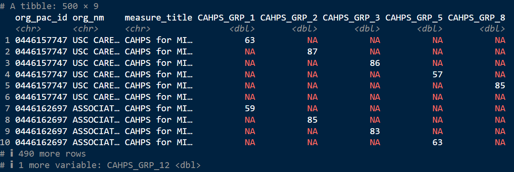

# 简介

这作者实在是太有意思了，引用托尔斯泰的话，然后改成自己的话。整洁的数据都很像，但是糟糕的数据各有各的糟糕。

整理数据确实是要花费时间，但是可以节约分析数据的时间。

两个需要了解的概念：

- tidy data：啥是整洁数据
- pivot：我知道相关的函数，但是一直不知道pivoting在数据整理中是转换数据形式的意思。

# 整洁数据

```R
table1
#> # A tibble: 6 × 4
#>   country      year  cases population
#>   <chr>       <dbl>  <dbl>      <dbl>
#> 1 Afghanistan  1999    745   19987071
#> 2 Afghanistan  2000   2666   20595360
#> 3 Brazil       1999  37737  172006362
#> 4 Brazil       2000  80488  174504898
#> 5 China        1999 212258 1272915272
#> 6 China        2000 213766 1280428583

table2
#> # A tibble: 12 × 4
#>   country      year type           count
#>   <chr>       <dbl> <chr>          <dbl>
#> 1 Afghanistan  1999 cases            745
#> 2 Afghanistan  1999 population  19987071
#> 3 Afghanistan  2000 cases           2666
#> 4 Afghanistan  2000 population  20595360
#> 5 Brazil       1999 cases          37737
#> 6 Brazil       1999 population 172006362
#> # ℹ 6 more rows

table3
#> # A tibble: 6 × 3
#>   country      year rate             
#>   <chr>       <dbl> <chr>            
#> 1 Afghanistan  1999 745/19987071     
#> 2 Afghanistan  2000 2666/20595360    
#> 3 Brazil       1999 37737/172006362  
#> 4 Brazil       2000 80488/174504898  
#> 5 China        1999 212258/1272915272
#> 6 China        2000 213766/1280428583
```

显然第一个是整洁的数据。第二个把两个变量融到一个去了，不太好。第三个用文本的形式搞成了一个比，不仅不好理解，也不好提取（split）

整洁数据的要求：

- **变量**：每个变量对应数据表中的一列；每一列代表一个变量。
- **观察记录**：每一行代表一个观察记录；每个观察记录是一行。
- **值**：每个单元格包含一个值；每个值是单元格中的单一数据点。

> 还是他总结的好，设计的好。图也很直观。
>
> 行是行，竖是竖，一格是一格


两点优势：

1. 一致的结构，分析工具互通互用
2. R是向量化计算的，很适用

> 这里的练习就算了吧，还涉及pivot_wider呢。

# 宽转长

为啥很多数据都不整洁？

- 方便录入的目的
- 很多人不知道整洁的数据原则

接下来学习的就是两个函数`pivot_longer`和`pivot_wider`这两个长宽数据转换的函数，一开始我以为没啥用，后来发现很有用啊。比自己写什么循环好使多了。

## 数据在列里面

```R
billboard
#> # A tibble: 317 × 79
#>   artist       track               date.entered   wk1   wk2   wk3   wk4   wk5
#>   <chr>        <chr>               <date>       <dbl> <dbl> <dbl> <dbl> <dbl>
#> 1 2 Pac        Baby Don't Cry (Ke… 2000-02-26      87    82    72    77    87
#> 2 2Ge+her      The Hardest Part O… 2000-09-02      91    87    92    NA    NA
#> 3 3 Doors Down Kryptonite          2000-04-08      81    70    68    67    66
#> 4 3 Doors Down Loser               2000-10-21      76    76    72    69    67
#> 5 504 Boyz     Wobble Wobble       2000-04-15      57    34    25    17    17
#> 6 98^0         Give Me Just One N… 2000-08-19      51    39    34    26    26
#> # ℹ 311 more rows
#> # ℹ 71 more variables: wk6 <dbl>, wk7 <dbl>, wk8 <dbl>, wk9 <dbl>, …
```

> 这个数据的一个特点就是后面还跟着一大堆NA的列。

这个数据有很多列，想法应该是把后面性质相同的列加一个分类变量容纳列名的信息，也就是宽数据转换为长数据。那`pivot_longer`干的就是这个事情。基本用法就长下面这样。

```R
billboard %>% 
  pivot_longer(cols = starts_with('wk'),
               names_to = 'week',
               values_to = "rank")
```

所以`starts_with`并不是只能在`select`里面使用的。在这里这样确实是方便一点。这个作者和我想的一样，不然就是感叹号取反了。

然后去掉缺失值也可以在参数里面设置。

```R
billboard %>% 
  pivot_longer(cols = starts_with('wk'),
               names_to = 'week',
               values_to = "rank",
               values_drop_na = T)
```

这个作者又跟我想到一块去了，这个wk6啥的不适合计算。所以需要进行文本的提取，如果是我的话，肯定就使用stringr里面的sub了。但是好像还有更方便的函数

```R
billboard %>% 
  pivot_longer(cols = starts_with('wk'),
               names_to = 'week',
               values_to = "rank",
               values_drop_na = T) %>% 
  mutate(week = parse_number(week))
```

这个`parse_number`只能取第一个数字，那还是不如我的`str_sub`呢。但是因为有数据的都是个位数以内的，去掉NA之后，也确实是没有问题的。

```R
ggplot(billboard_longer,aes(x = week, y = rank,group = track))+
  geom_line(alpha = 0.5)+
  scale_y_reverse()
```

顺带告诉咱们设置不透明度以及y轴进行一个反转的操作

## pivot的工作原理

话说`tibble`和`tribble`有啥区别啊。tibble还是想之前的dataframe的，但是tribble可以更加直观的用表格的方式建立“表格”。这个倒是有点像latex了。

```R
df <- tribble(
  ~id,  ~bp1, ~bp2,
   "A",  100,  120,
   "B",  140,  115,
   "C",  120,  125
)
```

图还是很直观的。


这个有需求就会明白，没有需求就不会不知所云。

## 多个变量在一个列名中

```R
> colnames(who2)
 [1] "country"    "year"       "sp_m_014"   "sp_m_1524"  "sp_m_2534"  "sp_m_3544"  "sp_m_4554" 
 [8] "sp_m_5564"  "sp_m_65"    "sp_f_014"   "sp_f_1524"  "sp_f_2534"  "sp_f_3544"  "sp_f_4554" 
[15] "sp_f_5564"  "sp_f_65"    "sn_m_014"   "sn_m_1524"  "sn_m_2534"  "sn_m_3544"  "sn_m_4554" 
[22] "sn_m_5564"  "sn_m_65"    "sn_f_014"   "sn_f_1524"  "sn_f_2534"  "sn_f_3544"  "sn_f_4554" 
[29] "sn_f_5564"  "sn_f_65"    "ep_m_014"   "ep_m_1524"  "ep_m_2534"  "ep_m_3544"  "ep_m_4554" 
[36] "ep_m_5564"  "ep_m_65"    "ep_f_014"   "ep_f_1524"  "ep_f_2534"  "ep_f_3544"  "ep_f_4554" 
[43] "ep_f_5564"  "ep_f_65"    "rel_m_014"  "rel_m_1524" "rel_m_2534" "rel_m_3544" "rel_m_4554"
[50] "rel_m_5564" "rel_m_65"   "rel_f_014"  "rel_f_1524" "rel_f_2534" "rel_f_3544" "rel_f_4554"
[57] "rel_f_5564" "rel_f_65"  
```

这样一个数据，除了前两个是不用变的，后面的分别包含诊断方法，性别和年龄范围。

也就是要拆开变量名了。

```R
who2 %>% pivot_longer(cols = !c(country:year),
                     names_to = c('diagnosis','gender','age'),
                     names_sep = '_',
                     values_to = 'count')
```

也就是多加一个参数`names_sep`，就会将变量名拆开了。不过这显然是好拆开的记录方式。


## 变量和变量名都在列名中

看似很奇怪，但是看到数据好像也还好。确实不用tidyverse就得自己造轮子了。

```R
household
#> # A tibble: 5 × 5
#>   family dob_child1 dob_child2 name_child1 name_child2
#>    <int> <date>     <date>     <chr>       <chr>      
#> 1      1 1998-11-26 2000-01-29 Susan       Jose       
#> 2      2 1996-06-22 NA         Mark        <NA>       
#> 3      3 2002-07-11 2004-04-05 Sam         Seth       
#> 4      4 2004-10-10 2009-08-27 Craig       Khai       
#> 5      5 2000-12-05 2005-02-28 Parker      Gracie
```

```R
household %>% pivot_longer(cols = !family,
                           names_to = c('.value','child'),
                           names_sep = '_',
                           values_drop_na = T)
```

不知道这个该怎么描述。不过你看，这里就不用写values_to了，相当于就是说保留原本的值的意思呗。把列名里的变量写到记录当中去。


# 长转宽

这里就是使用`pivot_wider`的方法了

> 长数据比较适合选择子集，画图好用
>
> 这个我要做一些数据计算的时候比较好用。然后数据观察也是一样的

这里的数据集主要就是有同质的，而且数量也不是很多对吧。

```R
cms_patient_experience |> 
  distinct(measure_cd, measure_title)
#> # A tibble: 6 × 2
#>   measure_cd   measure_title                                                 
#>   <chr>        <chr>                                                         
#> 1 CAHPS_GRP_1  CAHPS for MIPS SSM: Getting Timely Care, Appointments, and In…
#> 2 CAHPS_GRP_2  CAHPS for MIPS SSM: How Well Providers Communicate            
#> 3 CAHPS_GRP_3  CAHPS for MIPS SSM: Patient's Rating of Provider              
#> 4 CAHPS_GRP_5  CAHPS for MIPS SSM: Health Promotion and Education            
#> 5 CAHPS_GRP_8  CAHPS for MIPS SSM: Courteous and Helpful Office Staff        
#> 6 CAHPS_GRP_12 CAHPS for MIPS SSM: Stewardship of Patient Resources
```

那么基本用法就是：

```R
cms_patient_experience %>% 
  pivot_wider(
    names_from = measure_cd,
    values_from = prf_rate
  )
```

这次不用选择列名，选择一个变量，把变量里面的因子变成列名，然后分配一个一个值给他，但是我觉得这个很有可能会不是很好用。因为可能还得进行批量的修改。

但是这样好像也不是很对，因为好像进行了类似独码编码的格式，只用一行记录一个信息。



这也看来也还是得定义唯一编码的列，这里就和`pivot_longer`就不一样了，那个选择要变成因子的列。所以我感觉有的时候这两个玩意儿还是很绕的。

```R
cms_patient_experience %>% 
  pivot_wider(id_cols = 1:2,#starts_with('org')
              names_from = measure_cd,
              values_from = prf_rate)
```

这样就完整了，你看连参数都不一样了，这里的id指的是唯一编码的方式。

## pivot_wider啥原理

> 但是我还是不知道，什么时候要id，什么时候不用id啊。

哦我好像知道了，就是说出现wider后除了value列之外有重复的就可能会出现NA对吧。不知道。（因为我想到这样的原理就会有重复的列啊，那会怎么处理呢？）

你看作者给我们拆解一个大致的原理。

```R
df |> 
  distinct(measurement) |> 
  pull()
#> [1] "bp1" "bp2" "bp3"
```

先告诉我要把那几个因子变成列名

```R
df |> 
  select(-measurement, -value) |> 
  distinct()
#> # A tibble: 2 × 1
#>   id   
#>   <chr>
#> 1 A    
#> 2 B
```

去掉因子列，值列，剩下的别重复

```r
df |> 
  select(-measurement, -value) |> 
  distinct() |> 
  mutate(x = NA, y = NA, z = NA)
#> # A tibble: 2 × 4
#>   id    x     y     z    
#>   <chr> <lgl> <lgl> <lgl>
#> 1 A     NA    NA    NA   
#> 2 B     NA    NA    NA
```

新增几列，然后把值天进去

------

```R
df <- tribble(
  ~id, ~measurement, ~value,
  "A",        "bp1",    100,
  "A",        "bp1",    102,
  "A",        "bp2",    120,
  "B",        "bp1",    140, 
  "B",        "bp2",    115
)
```

这个就转变不了了吧，因为存在前两行是一样的

```R
df |>
  pivot_wider(
    names_from = measurement,
    values_from = value
  )
#> Warning: Values from `value` are not uniquely identified; output will contain
#> list-cols.
#> • Use `values_fn = list` to suppress this warning.
#> • Use `values_fn = {summary_fun}` to summarise duplicates.
#> • Use the following dplyr code to identify duplicates.
#>   {data} |>
#>   dplyr::summarise(n = dplyr::n(), .by = c(id, measurement)) |>
#>   dplyr::filter(n > 1L)
#> # A tibble: 2 × 3
#>   id    bp1       bp2      
#>   <chr> <list>    <list>   
#> 1 A     <dbl [2]> <dbl [1]>
#> 2 B     <dbl [1]> <dbl [1]>
```

这个时候应该base里面的aggregate或者tidyr里面的summarise后处理。

```R
df |> 
  group_by(id, measurement) |> 
  summarize(n = n(), .groups = "drop") |> 
  filter(n > 1)
#> # A tibble: 1 × 3
#>   id    measurement     n
#>   <chr> <chr>       <int>
#> 1 A     bp1             2
df %>% 
  group_by(id,measurement) %>% 
  count() %>% 
  filter(n > 1)
```

这可以帮我找到重复行

用count不是稍微简单一些吗。

-----

> 这一章竟然没有练习。
