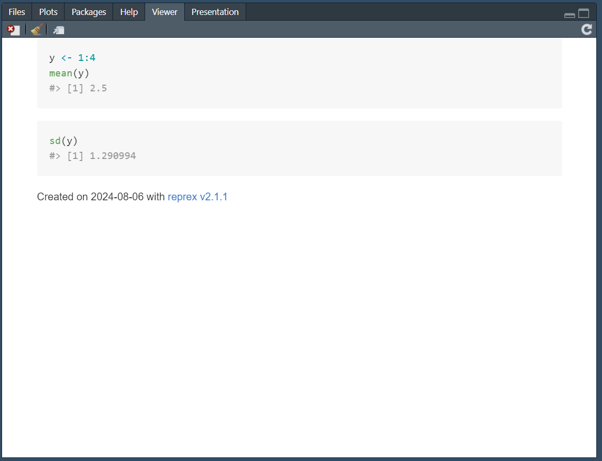

第一句话讲的就很好，这本书不是一个孤岛，也没有单一的资源能让你掌握R。当我们用R的技巧应用到自己的数据上面的时候，很快就会发现这本书没有讲到的问题。

> 说的太对了，简直讲到心巴上了。要是我早一点看到这本书就好了。

# 谷歌是你的好伙伴

那咱们中国就是百度，然后出来一堆CSDN。为此我还特地搞了个油猴脚本，但是这个不能看到CSDN付费专栏啊。甚至还可以直接用别的油猴，直接屏蔽CSDN我觉得也不错。主要是两种情况，一个是不知道怎么用什么函数，实现什么操作的时候。另一种就是看不懂报错。

作者还推荐[Stack Overflow](https://stackoverflow.com/)我觉得这个比CSDN厉害多了。

# 制作一个最小可复现示例

所谓reprex是一个常用的缩写：**repr**oducible **ex**ample。怎么制作呢？

主要就是两步：

1. 把事前的设定都确定好，比如library()
2. 丢掉不必要，不直接导致问题的信息。

好处是什么？（这也有二八定律）

1. 80%的情况在丢掉不必要的过程中，自己就能发现问题的核心。
2. 20%的情况，就很方便别人来回答咱们自己的问题。

我还以为是一个历年，没想到还真有一个函数？

``` r
y <- 1:4
mean(y)
#> [1] 2.5
```

<sup>Created on 2024-08-06 with [reprex v2.1.1](https://reprex.tidyverse.org)</sup> 

感觉这个好像没有那么好用啊。

我翻看了文档才知道这个原来是这么用的呀，一个括号加一个大括号，确实是很少见的语法

```R
reprex::reprex({
y <- 1:4
mean(y)
sd(y)
})
```

然后剪贴板可以直接复制md格式的文字

``` r
y <- 1:4
mean(y)
#> [1] 2.5
```

``` r
sd(y)
#> [1] 1.290994
```

<sup>Created on 2024-08-06 with [reprex v2.1.1](https://reprex.tidyverse.org)</sup>

同时在右下角的窗口还有这样的网页展示



不过按照这本书的作者的说法好像是一个函数在控制台弄完再接着这个`reprex::reprex`就好了。

然后还提供了三条建议

1.及时更新包，tidyver的包可以用`tidyverse_update()`

```R
tidyverse_update()
#All tidyverse packages up-to-date
```

2.重现数据

```R
a <- tibble(
  x = 1:4,
  y = runif(4) %>% round(3)
)
dput(a)

structure(list(x = 1:4, y = c(0.522, 0.03, 0.172, 0.796)), class = c("tbl_df", 
"tbl", "data.frame"), row.names = c(NA, -4L))
```

这是个啥函数？然后这个数据就可以直接给别人复制了嘛？

3.代码：规范的空格使得代码更易读；注释指出问题所在快速定位；移除无关内容，展示问题核心。

这里倒是没有什么函数了。

# 投资自己

求人不如求己，说的就是这个道理

关注 [tidyverse blog](https://www.tidyverse.org/blog/) 他们的团队

关注R的社区 [R Weekly](https://rweekly.org/) 

简单看来一下，一打开就是Positron。现在终于知道五柳冰冰这个up是哪里搞来这么多R的最新前言了。

--------

到此为止第一部分Whole game就学完了，其实差不多了，基本入门了tidyverse风格的数据处理是怎么搞的。确实是R的进阶课程。
