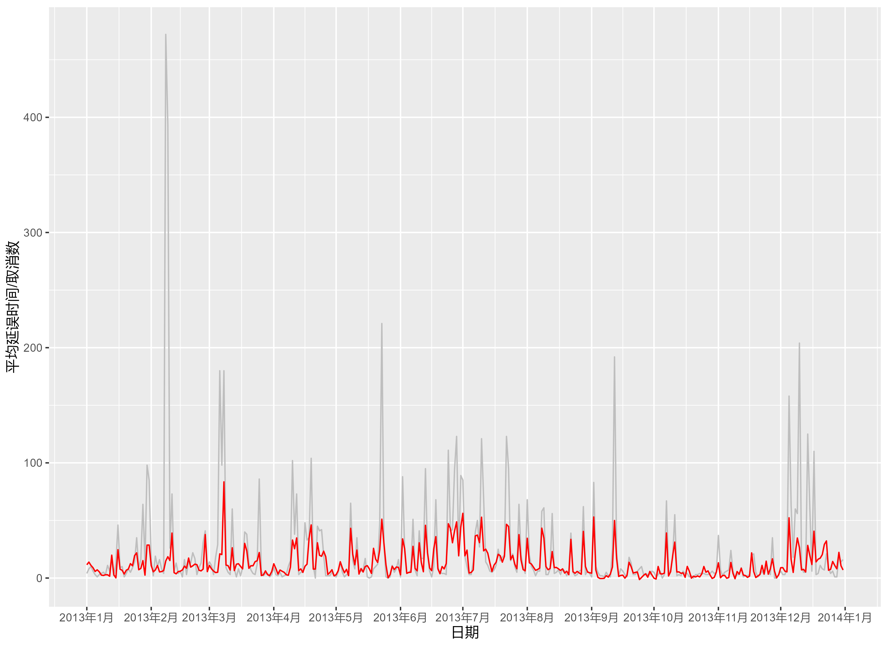
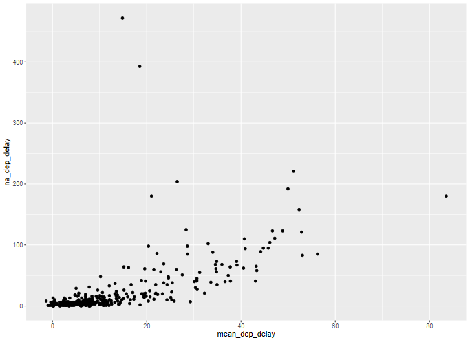

# 前言

这一章开始就是Transform数据转换的部分了，这个应该是最重要的部分了吧。


wow这章教的东西也还蛮不少的嘛，还都是我后来遇到的进阶内容，看来这本书用来入门是真的不太好呢。

1. **逻辑向量（Logical vectors）**：逻辑向量是最简单的向量类型之一，但它们非常强大。你将学习如何使用数值比较来创建它们，如何用布尔代数将它们组合起来，如何将它们用于摘要统计，以及如何将它们用于条件转换。
2. **数字（Numbers）**：深入探讨数字向量的工具，这是数据科学的核心。你将学习更多关于计数以及许多重要的转换和摘要函数。
3. **字符串（Strings）**：将提供处理字符串的工具：你将学会如何切割、组合字符串。本章主要集中在stringr包上，但也会学习一些专门用于从字符字符串中提取数据的tidyr函数。
4. **正则表达式（Regular expressions）**：介绍正则表达式，这是一种强大的字符串操作工具。本章将教你从认为键盘上走过一只猫，到阅读和编写复杂的字符串模式。
5. **因子（Factors）**：介绍因子，这是R用来存储分类数据的数据类型。当你的变量有一组固定的可能值，或者当你想要使用非字母顺序的字符串排序时，你会使用因子。
6. **日期和时间（Dates and times）**：将提供处理日期和时间的关键工具。不幸的是，你越了解日期时间，它们似乎就越复杂，但在lubridate包的帮助下，你将学会如何克服最常见的挑战。
7. **缺失值（Missing values）**：深入讨论缺失值。我们已经在孤立的情况下讨论了它们几次，但现在是时候全面讨论它们了，帮助你理解隐式和显式缺失值之间的区别，以及你如何以及为什么要在它们之间转换。
8. **连接（Joins）**：这部分书籍以提供连接两个或更多数据框的工具结束。学习连接将迫使你理解键的概念，并思考如何在数据集中识别每一行。

# 前言2

这个才是这一章的前言，这本书的设置也是由浅入深，先从向量，并且是逻辑向量开始。（逻辑是最简单的，向量是R的特点）

你以为逻辑无非是0和1，实际上是: `TRUE`, `FALSE`, 和`NA`. 虽然R支持T和F替代，但是出于语法规范还是得写全。

```R
library(tidyverse)
library(nycflights13)
```

```r
x <- c(1, 2, 3, 5, 7, 11, 13)
x * 2
#> [1]  2  4  6 10 14 22 26
df <- tibble(x)
df |> 
  mutate(y = x * 2)
```

`c()`构建一个向量，这个向量可以进行数乘

# 比较

一般不会直接得到逻辑向量，但是比较可以。这些之前都接触过了。不过都是过程之中用到。

```R
flights |> 
  filter(dep_time > 600 & dep_time < 2000 & abs(arr_delay) < 20)
#> # A tibble: 172,286 × 19
#>    year month   day dep_time sched_dep_time dep_delay arr_time sched_arr_time
#>   <int> <int> <int>    <int>          <int>     <dbl>    <int>          <int>
#> 1  2013     1     1      601            600         1      844            850
#> 2  2013     1     1      602            610        -8      812            820
#> 3  2013     1     1      602            605        -3      821            805
#> 4  2013     1     1      606            610        -4      858            910
#> 5  2013     1     1      606            610        -4      837            845
#> 6  2013     1     1      607            607         0      858            915
#> # ℹ 172,280 more rows
#> # ℹ 11 more variables: arr_delay <dbl>, carrier <chr>, flight <int>, …
```

要想知道底层变量（也就是逻辑向量）那就保存下来呗。

```R
flights |> 
  mutate(
    daytime = dep_time > 600 & dep_time < 2000,
    approx_ontime = abs(arr_delay) < 20,
    .keep = "used"
  )
#> # A tibble: 336,776 × 4
#>   dep_time arr_delay daytime approx_ontime
#>      <int>     <dbl> <lgl>   <lgl>        
#> 1      517        11 FALSE   TRUE         
#> 2      533        20 FALSE   FALSE        
#> 3      542        33 FALSE   FALSE        
#> 4      544       -18 FALSE   TRUE         
#> 5      554       -25 FALSE   FALSE        
#> 6      554        12 FALSE   TRUE         
#> # ℹ 336,770 more rows
```

```r
flights |> 
  mutate(
    daytime = dep_time > 600 & dep_time < 2000,
    approx_ontime = abs(arr_delay) < 20,
  ) |> 
  filter(daytime & approx_ontime)
```

神奇了，本质上都是按照逻辑向量进行数据操作的。但是这里还是帮助咱们了解背后的机制，用的时候倒是不需要考虑这么多，但是下面是更细节的方面。

## 浮点数比较

这个感觉比较细节，因为咱们看到的数不一定就是计算机内部空间的数字。这应该取决于变量类型以及经过什么样的运算和转变。

```R
x <- c(1 / 49 * 49, sqrt(2) ^ 2)
x
#> [1] 1 2
x == c(1, 2)
#> [1] FALSE FALSE
```

说的对吧

```r
print(x, digits = 16)
#> [1] 0.9999999999999999 2.0000000000000004
```

通过设置print后面的精确度，发现了端倪。

这边还提供了一个方法，这个方法的好处我觉得就是可以不改变数据原本的值，就可以进行粗略的比较。话说python是不是也有个约等号的呢。

```R
library(dplyr)
near(x, c(1, 2))
#> [1] TRUE TRUE
```

换做是以前的我，肯定就进行数据转换了。但也就是仅仅适用于这个例子罢了。

```R
round(x) == 1:2
#> [1] TRUE TRUE
```

## 缺失值的比较

缺失值是比较讨厌的。我恰好也想到一个词，那就是**污染**。这个作者称之为**传染contagious**。几乎和缺失值进行的任何操作结果都是缺失值。

```R
NA > 5
#> [1] NA
10 == NA
#> [1] NA
NA == NA
#> [1] NA
```

似乎NA == NA应该是TRUE。但是不然，这个作者举了一个很生动的例子，立马我就理解了。

```R
# We don't know how old Mary is
age_mary <- NA

# We don't know how old John is
age_john <- NA

# Are Mary and John the same age?
age_mary == age_john
#> [1] NA
# We don't know!
```

现在我知道为啥不支持在条件语句中写`XX == NA`了

```R
flights |> 
  filter(dep_time == NA)
#> # A tibble: 0 × 19
#> # ℹ 19 variables: year <int>, month <int>, day <int>, dep_time <int>,
#> #   sched_dep_time <int>, dep_delay <dbl>, arr_time <int>, …
```

筛选不出来，换做baseR早就报错了，告诉咱们要用`is.na()`。VScode中R的debugger也提示需要`is.na`。

```R
flights %>%
  filter(is.na(dep_time))
```

这么写就对了。

```R
is.na(c(TRUE, NA, FALSE))
#> [1] FALSE  TRUE FALSE
is.na(c(1, NA, 3))
#> [1] FALSE  TRUE FALSE
is.na(c("a", NA, "b"))
#> [1] FALSE  TRUE FALSE
```

只要是缺失值，那就是`TURE`

那要是想看看一个数据集中缺失值大致长啥样，可以和`arrange`联用

```R
flights %>%
  filter(month == 1 & day == 1) %>%
  arrange(desc(is.na(dep_time)), dep_time)
```

这样同时还能保证NA下面的还是按照顺序排列，尽管用了两次dep_time。

## 练习

> How does `dplyr::near()` work? Type `near` to see the source code. Is `sqrt(2)^2` near 2?

``` r
near(sqrt(2)^2, 2)
#> [1] TRUE
```

好像是对的呀。

```R
near(x, y, tol = .Machine$double.eps^0.5)
```

看来还能设置容差。

> Use `mutate()`, `is.na()`, and `count()` together to describe how the missing values in `dep_time`, `sched_dep_time` and `dep_delay` are connected.

不太理解。

```R
flights %>%
  mutate(res = 60 * (dep_time %/% 100 - sched_dep_time %/% 100) + dep_time %% 100 - sched_dep_time %% 100) %>%
  relocate(res, dep_delay)
```

这三个的关系就是时间的加减，不过是60进制的罢了。但是要讨论的是缺失值是怎么关系的。

不需要distinct函数检查3位的逻辑组合情况，也不用保留运算过的字段，用count直接计数，那么就可以这么写了。

```R
flights %>%
  mutate(
    dep_time_na = is.na(dep_time),
    sched_dep_time_na = is.na(sched_dep_time),
    dep_delay_na = is.na(dep_delay),
  ) %>%
  count(dep_time_na, sched_dep_time_na, dep_delay_na)
#> # A tibble: 2 × 4
#>   dep_time_na sched_dep_time_na dep_delay_na      n
#>   <lgl>       <lgl>             <lgl>         <int>
#> 1 FALSE       FALSE             FALSE        328521
#> 2 TRUE        FALSE             TRUE           8255
```

可以正常运算的，就是第一行，符合我之前的运算公式。

不能运算的，那就是延迟时间未知的，计划延迟时间都是有记载的，那么真实延迟时间也就不得而知了。

# 布尔计算

最基础的就是三个吧

- &是and
- |是or
- !是取反

但是好像还有好多别的写法。但是注意，这里不是集合运算，而是过程中的条件的逻辑向量的写法。


>  R also has `&&` and `||`

据说这个是两个条件一起，单独就是逐个元素比较。（又牵扯了远古的python学习记忆）你看这不就来了吗，涉及顺序的。

## 缺失值

```R
df <- tibble(x = c(TRUE, FALSE, NA))

df |> 
  mutate(
    and = x & NA,
    or = x | NA
  )
#> # A tibble: 3 × 3
#>   x     and   or   
#>   <lgl> <lgl> <lgl>
#> 1 TRUE  NA    TRUE 
#> 2 FALSE FALSE NA   
#> 3 NA    NA    NA
```

那是因为

```r
NA | TRUE
TRUE | NA
NA & TRUE
TRUE & NA
[1] TRUE
[1] TRUE
[1] NA
[1] NA
```

```r
FALSE | NA
NA | FALSE
FALSE & NA
NA & FALSE
[1] NA
[1] NA
[1] FALSE
[1] FALSE
```

看来这里左右不影响（估计两个&&或||就有影响了）。TRUE的or就是有一个就满足，FALSE就是有一个and就满足。其他都是NA。

## 操作顺序

这里就是解释了一个想当然的错误

```R
flights |> 
   filter(month == 11 | month == 12)
```

常规来说应该这么写

```R
flights |> 
   filter(month == 11 | 12)
```

这么写就错了，不是报错，而是没有是实现目的，我觉得相当于`month == TRUE`无法进行筛选了。

```R
flights |> 
  mutate(
    nov = month == 11,
    final = nov | 12,
    .keep = "used"
  )
#> # A tibble: 336,776 × 3
#>   month nov   final
#>   <int> <lgl> <lgl>
#> 1     1 FALSE TRUE 
#> 2     1 FALSE TRUE 
#> 3     1 FALSE TRUE 
#> 4     1 FALSE TRUE 
#> 5     1 FALSE TRUE 
#> 6     1 FALSE TRUE 
#> # ℹ 336,770 more rows
```

当然，这样更细节。

## %in%

这个就是实现多个or了。

```R
1:12 %in% c(1, 5, 11)
#>  [1]  TRUE FALSE FALSE FALSE  TRUE FALSE FALSE FALSE FALSE FALSE  TRUE FALSE
letters[1:10] %in% c("a", "e", "i", "o", "u")
#>  [1]  TRUE FALSE FALSE FALSE  TRUE FALSE FALSE FALSE  TRUE FALSE
```

返回的就是一个原长度的逻辑向量，符合的位置就是TRUE，不符合就是FALSE。

> 我用多了就知道效果了，一开始肯定也是不知道效果和原理的。

```R
flights |> 
  filter(month %in% c(11, 12))
```

这样写就更像自然语言了。

```R
c(1, 2, NA) == NA
#> [1] NA NA NA
c(1, 2, NA) %in% NA
#> [1] FALSE FALSE  TRUE
```

对于缺失值也是可以成立的，这个就很不错。

```R
flights |> 
  filter(dep_time %in% c(NA, 0800))
#> # A tibble: 8,803 × 19
#>    year month   day dep_time sched_dep_time dep_delay arr_time sched_arr_time
#>   <int> <int> <int>    <int>          <int>     <dbl>    <int>          <int>
#> 1  2013     1     1      800            800         0     1022           1014
#> 2  2013     1     1      800            810       -10      949            955
#> 3  2013     1     1       NA           1630        NA       NA           1815
#> 4  2013     1     1       NA           1935        NA       NA           2240
#> 5  2013     1     1       NA           1500        NA       NA           1825
#> 6  2013     1     1       NA            600        NA       NA            901
#> # ℹ 8,797 more rows
#> # ℹ 11 more variables: arr_delay <dbl>, carrier <chr>, flight <int>, …
```

## 练习

> Find all flights where `arr_delay` is missing but `dep_delay` is not. Find all flights where neither `arr_time` nor `sched_arr_time` are missing, but `arr_delay` is.

这有两个任务

```R
flights %>%
  filter(is.na(arr_delay) & !is.na(dep_delay))
flights %>%
  filter(!is.na(arr_time) & !is.na(sched_arr_time) & is.na(arr_delay))
```

> How many flights have a missing `dep_time`? What other variables are missing in these rows? What might these rows represent?

这个我还真不会

> Assuming that a missing `dep_time` implies that a flight is cancelled, look at the number of cancelled flights per day. Is there a pattern? Is there a connection between the proportion of cancelled flights and the average delay of non-cancelled flights?

两个问题一起来好了，就不分开写了，那就不用count函数了，在summarise里面进行计数`sum()`

```R
mydata <- flights %>%
  mutate(date = make_date(year, month, day)) %>%
  group_by(date) %>%
  summarise(
    mean_dep_delay = mean(dep_delay, na.rm = T),
    na_dep_delay = sum(is.na(dep_delay))
  )
mydata %>%
  ggplot(aes(x = date)) +
  geom_line(aes(y = na_dep_delay), color = "grey") +
  geom_line(aes(y = mean_dep_delay), color = "red") +
  scale_x_date(date_breaks = "1 month", date_labels = "%Y年%b") +
  labs(x = "日期", y = "平均延误时间(min)/取消数")
ggplot(mydata, aes(x = mean_dep_delay, y = na_dep_delay)) +
  geom_point()
lm(na_dep_delay ~ mean_dep_delay, data = mydata) %>% summary()
```



看上去似乎呈现波动的趋势，然后延误时间和取消数的波动基本是一致的。

> 最好是画两个y轴，分别标出来单位。而且最好转换为长数据，颜色也得标出来legend。我这个确实是不标准，到那时数据探索就够了。



但是这真的有线性关系吗

```R
Call:
lm(formula = na_dep_delay ~ mean_dep_delay, data = mydata)

Residuals:
   Min     1Q Median     3Q    Max 
-51.72 -10.54  -2.61   3.56 444.71 

Coefficients:
               Estimate Std. Error t value Pr(>|t|)
(Intercept)     -5.1640     2.6745  -1.931   0.0543 .
mean_dep_delay   2.1849     0.1493  14.638   <2e-16 ***
---
Signif. codes:  0 '***' 0.001 '**' 0.01 '*' 0.05 '.' 0.1 ' ' 1

Residual standard error: 36 on 363 degrees of freedom
Multiple R-squared:  0.3712,    Adjusted R-squared:  0.3694
F-statistic: 214.3 on 1 and 363 DF,  p-value: < 2.2e-16
```

反正有统计学意义。说明可能确实和天气之类的外在因素有关系吧。

# 汇总

## 逻辑形式汇总

`any()` and `all()`俩函数

简而言之，`any()` 函数检查集合中是否至少有一个真值，而 `all()` 函数检查集合中的所有值是否都是真值。如果存在缺失值，可以通过设置 `na.rm = TRUE` 来处理。

```R
flights |> 
  group_by(year, month, day) |> 
  summarize(
    all_delayed = all(dep_delay <= 60, na.rm = TRUE),
    any_long_delay = any(arr_delay >= 300, na.rm = TRUE),
    .groups = "drop"
  )
#> # A tibble: 365 × 5
#>    year month   day all_delayed any_long_delay
#>   <int> <int> <int> <lgl>       <lgl>         
#> 1  2013     1     1 FALSE       TRUE          
#> 2  2013     1     2 FALSE       TRUE          
#> 3  2013     1     3 FALSE       FALSE         
#> 4  2013     1     4 FALSE       FALSE         
#> 5  2013     1     5 FALSE       TRUE          
#> 6  2013     1     6 FALSE       FALSE         
#> # ℹ 359 more rows
```

用`group_by()`联合这俩就能进行筛选日期了。

> 我之前用这个好像就是单纯检测向量是否存在NA
>
> ```r
> any(is.na(myvector))
> ```

## 数值汇总逻辑向量

就是说想知道有多少TRUE多少FALSE呗。

因为TRUE可以计算为1，FALSE可计算为0。那sum就可以计算数量，mean可以计算比例了。

> `mean()` is just `sum()` divided by `length()`

```R
flights |> 
  group_by(year, month, day) |> 
  summarize(
    proportion_delayed = mean(dep_delay <= 60, na.rm = TRUE),
    count_long_delay = sum(arr_delay >= 300, na.rm = TRUE),
    .groups = "drop"
  )
#> # A tibble: 365 × 5
#>    year month   day proportion_delayed count_long_delay
#>   <int> <int> <int>              <dbl>            <int>
#> 1  2013     1     1              0.939                3
#> 2  2013     1     2              0.914                3
#> 3  2013     1     3              0.941                0
#> 4  2013     1     4              0.953                0
#> 5  2013     1     5              0.964                1
#> 6  2013     1     6              0.959                0
#> # ℹ 359 more rows
```

## 子集/切片

subset

想知道平均迟到多久

```R
flights |> 
  filter(arr_delay > 0) |> 
  group_by(year, month, day) |> 
  summarize(
    behind = mean(arr_delay),
    n = n(),
    .groups = "drop"
  )
#> # A tibble: 365 × 5
#>    year month   day behind     n
#>   <int> <int> <int>  <dbl> <int>
#> 1  2013     1     1   32.5   461
#> 2  2013     1     2   32.0   535
#> 3  2013     1     3   27.7   460
#> 4  2013     1     4   28.3   297
#> 5  2013     1     5   22.6   238
#> 6  2013     1     6   24.4   381
#> # ℹ 359 more rows
```

但是还想知道早到的呢？那就用到了base里面的写法，但是不需要美元符，类似与attach了一样

```R
flights |> 
  group_by(year, month, day) |> 
  summarize(
    behind = mean(arr_delay[arr_delay > 0], na.rm = TRUE),
    ahead = mean(arr_delay[arr_delay < 0], na.rm = TRUE),
    n = n(),
    .groups = "drop"
  )
#> # A tibble: 365 × 6
#>    year month   day behind ahead     n
#>   <int> <int> <int>  <dbl> <dbl> <int>
#> 1  2013     1     1   32.5 -12.5   842
#> 2  2013     1     2   32.0 -14.3   943
#> 3  2013     1     3   27.7 -18.2   914
#> 4  2013     1     4   28.3 -17.0   915
#> 5  2013     1     5   22.6 -14.0   720
#> 6  2013     1     6   24.4 -13.6   832
#> # ℹ 359 more rows
```

> 哈哈哈越来越混乱了，看来base和tidy是不能互相分割的。
>
> 如果不用这个方法，那就要join了。

## 练习

> What will `sum(is.na(x))` tell you? How about `mean(is.na(x))`?

缺失数，缺失百分比

> What does `prod()` return when applied to a logical vector? What logical summary function is it equivalent to? What does `min()` return when applied to a logical vector? What logical summary function is it equivalent to? Read the documentation and perform a few experiments.

`prod`计算向量所有元素的乘积。

```R
print(prod(1:7)) == print(gamma(8))
#5040
```

``` r
prod(c(1, NA, 3))
#> [1] NA
```

``` r
prod(c(1, NA, 3), na.rm = T)
#> [1] 3
```

```r
prod(c(TRUE,FALSE,TRUE))
[1] 0

prod(c(TRUE,FALSE,TRUE,NA))
[1] NA

min(c(TRUE,FALSE,TRUE)) %>% as.logical()
[1] FALSE
```

相当于all()函数吧，只不过返回0。加一个逻辑转换就完事了。

# 条件转换

都是tidyverse的内置函数

if_else和case_when。

可不可以理解为前者判断题，后者多项选择题。

## if_else

```R
x <- c(-3:3, NA)
if_else(x > 0, "+ve", "-ve")
#> [1] "-ve" "-ve" "-ve" "-ve" "+ve" "+ve" "+ve" NA
```

基本写法就是一个条件，两个选择，TRUE第一个，FALSE第二个，NA保留

```R
if_else(x > 0, "+ve", "-ve", "???")
#> [1] "-ve" "-ve" "-ve" "-ve" "+ve" "+ve" "+ve" "???"
```

再加一个会被认为是NA的替换。

我有一个想法，ifelse里面其实也可以再嵌套一个if_else，谁说是非此即彼的判断题呢。

```R
if_else(x > 0, "positive", if_else(x < 0, "negative", "zero"),'missing')
```

这样才对嘛

还可以实现`coalesce`这个函数的功能（用另外一个向量弥补这个向量的缺失值的函数，来源于SQL，非常神奇）

https://dplyr.tidyverse.org/reference/coalesce.html

```r
x1 <- c(NA, 1, 2, NA)
y1 <- c(3, NA, 4, 6)
if_else(is.na(x1), y1, x1)
#> [1] 3 1 2 6
```

这个确实神奇。

## case_when

if_else嵌套起来不美观，case_when直观多了，但是代码量变多了。

```R
x <- c(-3:3, NA)
case_when(
  x == 0   ~ "0",
  x < 0    ~ "-ve", 
  x > 0    ~ "+ve",
  is.na(x) ~ "???"
)
#> [1] "-ve" "-ve" "-ve" "0"   "+ve" "+ve" "+ve" "???"
```

但是遇到没有匹配的就会变成NA

```R
case_when(
  x < 0 ~ "-ve",
  x > 0 ~ "+ve"
)
#> [1] "-ve" "-ve" "-ve" NA    "+ve" "+ve" "+ve" NA
```

```r
case_when(
  x < 0 ~ "-ve",
  x > 0 ~ "+ve",
  .default = "???"
)
#> [1] "-ve" "-ve" "-ve" "???" "+ve" "+ve" "+ve" "???"
```

因为默认就是NA，也可以修改默认的，相当于是NA替换一样的方法。

一旦条件发生重合，只会采用第一个，善加利用，合理调整数据可以减少代码量我觉得

```R
case_when(
  x > 0 ~ "+ve",
  x > 2 ~ "big"
)
#> [1] NA    NA    NA    NA    "+ve" "+ve" "+ve" NA
```

case_when也可以实现精确的连续转换为分类变量

```R
flights |> 
  mutate(
    status = case_when(
      is.na(arr_delay)      ~ "cancelled",
      arr_delay < -30       ~ "very early",
      arr_delay < -15       ~ "early",
      abs(arr_delay) <= 15  ~ "on time",
      arr_delay < 60        ~ "late",
      arr_delay < Inf       ~ "very late",
    ),
    .keep = "used"
  )
#> # A tibble: 336,776 × 2
#>   arr_delay status 
#>       <dbl> <chr>  
#> 1        11 on time
#> 2        20 late   
#> 3        33 late   
#> 4       -18 early  
#> 5       -25 early  
#> 6        12 on time
#> # ℹ 336,770 more rows
```

## 注意元素类型兼容

```R
if_else(TRUE, "a", 1)
#> Error in `if_else()`:
#> ! Can't combine `true` <character> and `false` <double>.

case_when(
  x < -1 ~ TRUE,  
  x > 0  ~ now()
)
#> Error in `case_when()`:
#> ! Can't combine `..1 (right)` <logical> and `..2 (right)` <datetime<local>>.
```

向量里面可不能存在不同类型的元素。只有少数几个变量才能互相兼容。

1. 数值型向量和逻辑型向量是兼容的
2. 字符串（String）和因子（Factor）是兼容的。因子可以被看作是具有限制值集的字符串。在数据处理中，因子通常用于分类数据，其值是预先定义好的一组标签。
3. 明日期（Date）和日期时间（Date-time）是兼容的。日期可以被视为日期时间的一个特殊情况，因为日期时间包含了日期和时间的信息。
4. NA（表示缺失值的符号）在技术上是一个逻辑型向量，并且它与所有类型的向量都是兼容的。这是因为每种向量都有表示缺失值的方法。例如，在数值型向量中，NA可能表示为NaN（Not a Number），在逻辑型向量中可能表示为NA。

> 这些不应该记住，但是在使用过程中会成为条件反射。

## 练习

> A number is even if it’s divisible by two, which in R you can find out with `x %% 2 == 0`. Use this fact and `if_else()` to determine whether each number between 0 and 20 is even or odd.

就是判断偶数咯。Codeium在我还没写完就补充起来了。

```R
ifelse(1:20 %%2 == 0, "even", "odd")
 [1] "odd"  "even" "odd"  "even" "odd"  "even" "odd"  "even" "odd"  "even" "odd"  "even" "odd"  "even" "odd"  "even" "odd"  "even" "odd"  "even"
```

> Given a vector of days like `x <- c("Monday", "Saturday", "Wednesday")`, use an `if_else()` statement to label them as weekends or weekdays.

```R
x <- c("Monday", "Saturday", "Wednesday")
if_else(x == "Saturday" | x == "Sunday", "weekend", "weekday")
[1] "weekday" "weekend" "weekday"
```

再用Codium我的代码能力就退化了哈哈哈。但是我觉得这种文书类的肯定更擅长

> Use `if_else()` to compute the absolute value of a numeric vector called `x`.

教你自己写一个用if_else的函数输出绝对值呗。虽然abs()就行了。’

```r
new_abs <- function(x) {
  if_else(x < 0, -x, x)
}
new_abs(-5)
#> [1] 5
new_abs(-3:3)
#> [1] 3 2 1 0 1 2 3
```

> Write a `case_when()` statement that uses the `month` and `day` columns from `flights` to label a selection of important US holidays (e.g., New Years Day, 4th of July, Thanksgiving, and Christmas). First create a logical column that is either `TRUE` or `FALSE`, and then create a character column that either gives the name of the holiday or is `NA`.

这个就算了吧，我不知道日期，也不过洋节日

```R
flights %>%
  mutate(
    is_holiday = case_when(
      month == 1 & day == 1 ~ TRUE,
      month == 7 & day == 4 ~ TRUE,
      month == 11 & day >= 22 & day <= 28 ~ TRUE,
      month == 12 & day == 25 ~ TRUE,
      TRUE ~ FALSE
    ),
    holiday_name = case_when(
      is_holiday & month == 1 & day == 1 ~ "New Year's Day",
      is_holiday & month == 7 & day == 4 ~ "4th of July",
      is_holiday & month == 11 & day >= 22 & day <= 28 ~ "Thanksgiving",
      is_holiday & month == 12 & day == 25 ~ "Christmas",
      TRUE ~ NA_character_
    )
  ) %>%
  relocate(is_holiday, holiday_name)
```

直接让AI来写了，我再补充一句，让咱们能看到结果。

# 总结

没想到这个章节，就这么几个函数和运算，能搞出这么多花来。

1. dplyr的if_else()函数与R语言基本包中的ifelse()函数非常相似。它们都是用来根据条件表达式来选择两个值中的一个。
2. 但是，if_else()函数有两个主要优势：
   - 第一个优势是，你可以指定如何处理缺失值（missing values）。在ifelse()函数中，如果条件表达式的结果为NA（即缺失值），那么整个ifelse()函数的结果也会是NA。而在if_else()中，你可以选择在条件为NA时返回什么值，例如返回NA、NULL或默认值等。
   - 第二个优势是，当变量类型不兼容时，if_else()函数更有可能给出一个有意义的错误提示。在ifelse()中，如果条件表达式和结果值的类型不匹配，R语言可能会自动进行类型转换，有时这会导致不直观的错误或结果。而if_else()则会在类型不兼容时给出更清晰的错误信息，帮助用户发现问题。

总的来说，if_else()函数提供了更多的灵活性和错误检测能力，使得在dplyr包中进行条件选择时更加方便和安全。

这个我也是想说的。