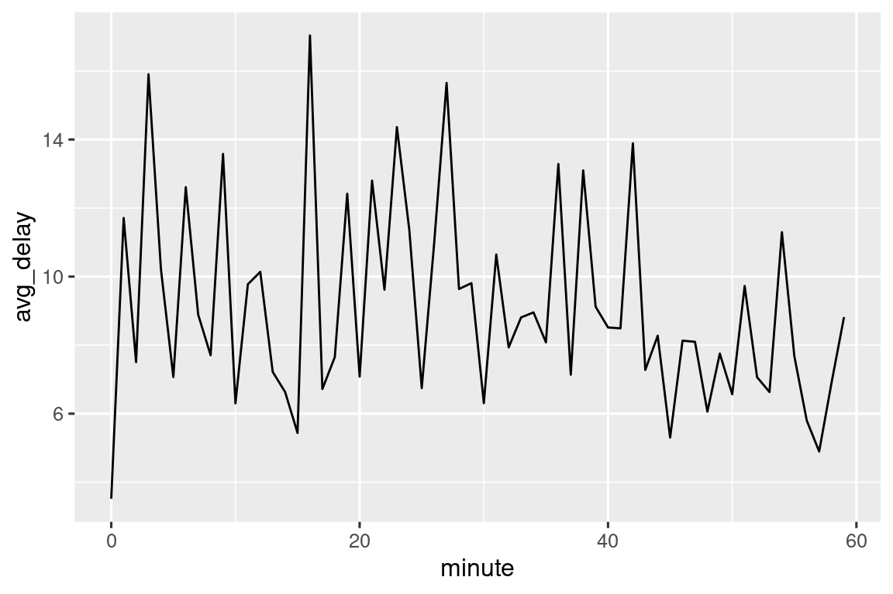
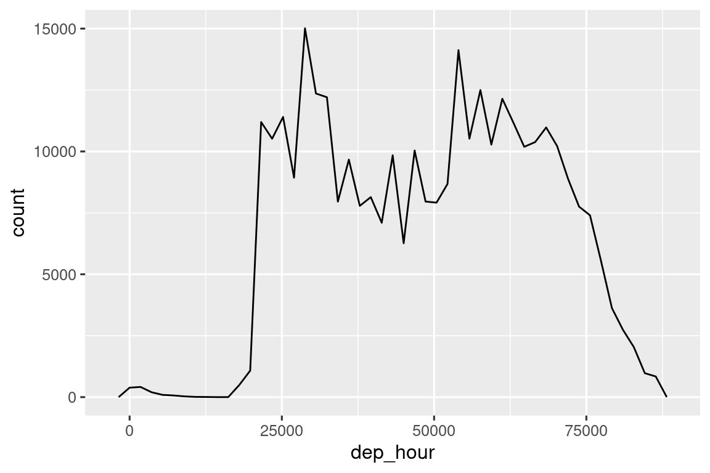
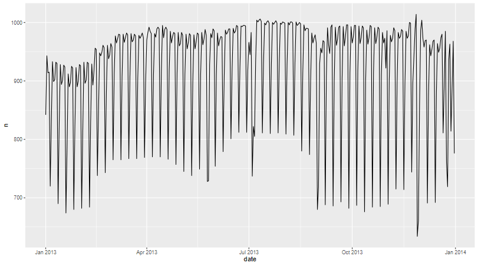
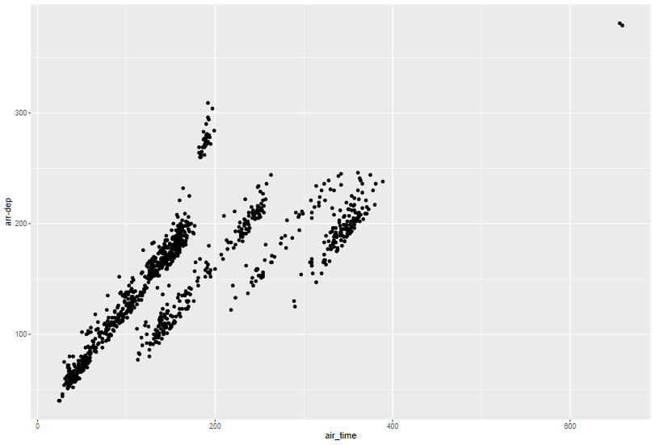
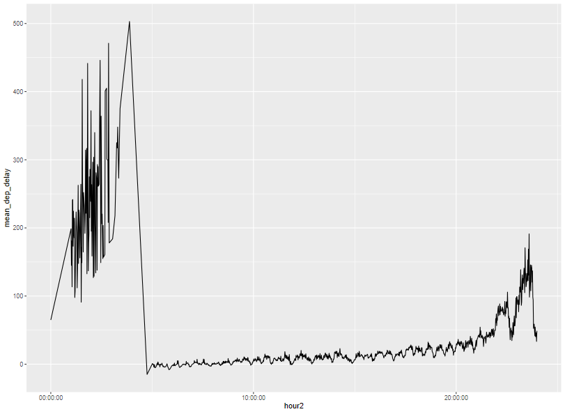
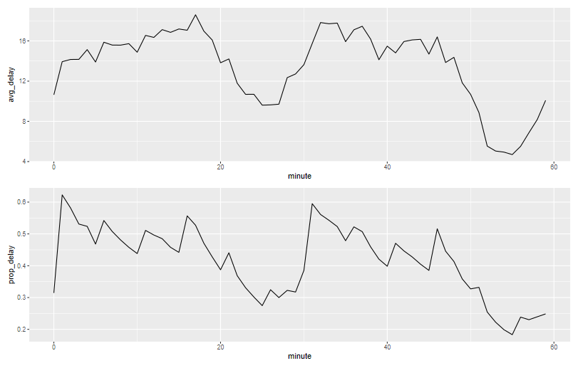

# 前言

这个日期和时间的类型的变量看着简单，用起来似乎是越来越深奥的。

> 进制，拆分，一年/一月有几天可以变化，展示形式多种多样。
>
> 国外还有什么夏令时23小时与25小时呢。

tidyverse对于日期的处理是用了`lubridate`包

做好准备吧，还是那个航班的数据库。

# 创建日期时间

有三种日期时间类型的数据结构

- date：日期 `<date>`
- time：时间 `<time>`
- date-time：日期时间 `<dttm>`  两个合并

> hms包能存储时间的原生类（原来baseR是没有的吗，这个我确实是不了解）。所谓的hms就是时分秒的意思。

**查看当前时间的函数**

```r
today()
#> [1] "2024-08-29"
now()
#> [1] "2024-08-29 23:08:59 UTC"
now()
#> [1] "2024-08-30 16:08:43 CST"
```

> 这个网页还挺神奇，能反映比较近的时间。不过书里的是UTC全球标准时间，而我们运行的时候则是中国标准时间CST
>
> 可以了解一下 [5分钟了解GMT,CST,UTC是什么鬼？](https://mp.weixin.qq.com/s?__biz=MzAxMjY5NDU2Ng==&mid=2651851840&idx=1&sn=3d2aae20832f6f6ffb9447a4f3f61644&chksm=80494909b73ec01f89d1ccfff9834170a2f97ed8fe8c38fadddf4c4ff11cb5fdc9f930e25cc3&scene=27)

产生日期时间的四种方式

1. 文件读取
2. 字符串
3. 单独的日期时间元素
4. 其他日期时间

## 文件读取

```R
csv <- "
  date,datetime
  2022-01-02,2022-01-02 05:12
"
read_csv(csv)
#> # A tibble: 1 × 2
#>   date       datetime           
#>   <date>     <dttm>             
#> 1 2022-01-02 2022-01-02 05:12:00
```

如果符合ISO8601格式的，readr里的函数能自动转换为日期形式的。

> 这是一种国际标准，各个部分从大到小排列，横杠分隔。日期时间用空格或者T分开，时分秒有的话用冒号分开。

当然也可以用read_csv中的参数定义字段类型。`col_types = cols()`。但是这样就要了解日期格式对应的格式了。

| Type  | Code  | Meaning                        | Example         |
| ----- | ----- | ------------------------------ | --------------- |
| Year  | `%Y`  | 4 digit year                   | 2021            |
|       | `%y`  | 2 digit year                   | 21              |
| Month | `%m`  | Number                         | 2               |
|       | `%b`  | Abbreviated name               | Feb             |
|       | `%B`  | Full name                      | February        |
| Day   | `%d`  | One or two digits              | 2               |
|       | `%e`  | Two digits                     | 02              |
| Time  | `%H`  | 24-hour hour                   | 13              |
|       | `%I`  | 12-hour hour                   | 1               |
|       | `%p`  | AM/PM                          | pm              |
|       | `%M`  | Minutes                        | 35              |
|       | `%S`  | Seconds                        | 45              |
|       | `%OS` | Seconds with decimal component | 45.35           |
|       | `%Z`  | Time zone name                 | America/Chicago |
|       | `%z`  | Offset from UTC                | +0800           |
| Other | `%.`  | Skip one non-digit             | :               |
|       | `%*`  | Skip any number of non-digits  |                 |

```R
csv <- "
  date
  01/02/15
"

read_csv(csv, col_types = cols(date = col_date("%m/%d/%y")))
#> # A tibble: 1 × 1
#>   date      
#>   <date>    
#> 1 2015-01-02

read_csv(csv, col_types = cols(date = col_date("%d/%m/%y")))
#> # A tibble: 1 × 1
#>   date      
#>   <date>    
#> 1 2015-02-01

read_csv(csv, col_types = cols(date = col_date("%y/%m/%d")))
#> # A tibble: 1 × 1
#>   date      
#>   <date>    
#> 1 2001-02-15
```

> 还蛮智能的，知道01就是2001。只要年月日对了，不管怎么展示，其实都是一个意思。
>
> ```R
> csv <- "
> date
> 01/Feb/15
> "
> read_csv(csv, col_types = cols(date = col_date("%y/%b/%d")))
> ```
>
> 但是不知道换形式展示之后中文展示和英文展示支不支持。

## 字符串转日期

lubridate有一些比较自动的函数，`ymd`，`mdy`，`dmy`这仨函数无非就是调换一下顺序也能读取各种字符串形式的日期形式的字符串。

```R
ymd("2017-01-31")
#> [1] "2017-01-31"
ymd("2017/01/31")
#> [1] "2017-01-31"
mdy("January 31st, 2017")
#> [1] "2017-01-31"
dmy("31-Jan-2017")
#> [1] "2017-01-31"
ymd(20130102)
#> [1] "2013-01-02"
```

要同时包括时间，后面加上hm/hms，变成`ymd_hms`就好了。

```R
ymd_hms("2017-01-31 20:11:59")
#> [1] "2017-01-31 20:11:59 UTC"
mdy_hm("01/31/2017 08:01")
#> [1] "2017-01-31 08:01:00 UTC"
```

也能设置时区（tz, time zone），那么是不是就是自动进行时区转换呢。

```R
ymd("2017-01-31", tz = "UTC")
#> [1] "2017-01-31 UTC"
```

## 独立时间元素组合成日期

这一般都是数字了。在表格中比较常用。这里就要用到`make_date`和`make_datetime`这两个函数。

```R
flights %>%
  select(year, month, day, hour, minute) %>%
  mutate(
    departure1 = make_date(year, month, day),
    departure2 = make_datetime(year, month, day, hour, minute)
  )
```

只要按照顺序一个个排进去就完事了。

我们看到这个数据集前面还有用数字，比如517表示5:17的。这样不太好，就需要进行模运算。我们写个函数把这部分数据转化为时间。基本思路就是除以100，商做h，余数作m

```R
make_datetime_100 <- function(year, month, day, time) {
  make_datetime(year, month, day, time %/% 100, time %% 100)
}

flights_dt <- flights |> 
  filter(!is.na(dep_time), !is.na(arr_time)) |> 
  mutate(
    dep_time = make_datetime_100(year, month, day, dep_time),
    arr_time = make_datetime_100(year, month, day, arr_time),
    sched_dep_time = make_datetime_100(year, month, day, sched_dep_time),
    sched_arr_time = make_datetime_100(year, month, day, sched_arr_time)
  ) |> 
  select(origin, dest, ends_with("delay"), ends_with("time"))

flights_dt
#> # A tibble: 328,063 × 9
#>   origin dest  dep_delay arr_delay dep_time            sched_dep_time     
#>   <chr>  <chr>     <dbl>     <dbl> <dttm>              <dttm>             
#> 1 EWR    IAH           2        11 2013-01-01 05:17:00 2013-01-01 05:15:00
#> 2 LGA    IAH           4        20 2013-01-01 05:33:00 2013-01-01 05:29:00
#> 3 JFK    MIA           2        33 2013-01-01 05:42:00 2013-01-01 05:40:00
#> 4 JFK    BQN          -1       -18 2013-01-01 05:44:00 2013-01-01 05:45:00
#> 5 LGA    ATL          -6       -25 2013-01-01 05:54:00 2013-01-01 06:00:00
#> 6 EWR    ORD          -4        12 2013-01-01 05:54:00 2013-01-01 05:58:00
#> # ℹ 328,057 more rows
#> # ℹ 3 more variables: arr_time <dttm>, sched_arr_time <dttm>, …
```

就是把所有数字表示时间的都变成了年月日时分的形式，然后选择出入延误和时间的列展示。可视化一下每天的延误次数，这你就会发现，日期也有序列的性质。

> 我是知道日期背后也是一串数字，但是不会解读
>
> ```R
> r$> ymd("2017-01-31")
> [1] "2017-01-31"
> r$> ymd("2017-01-31") %>% as.numeric()
> [1] 17197
> r$> ymd("2017-01-31") %>% as.numeric() %>% as.Date()
> [1] "2017-01-31"
> r$> mdy_hm("01/31/2017 08:01") %>% as.numeric()
> [1] 1485849660
> ```
>
> 我记得好像就是从某个时间点计为000……00然后往上加时间吧。
>
> 虽然咱们不需要知道这个初始的时间点是多少，但是记住相对的时间差就可以了。在date格式中，1表示1天，在time格式中1表示1秒。

```R
flights_dt |> 
  ggplot(aes(x = dep_time)) + 
  geom_freqpoly(binwidth = 86400) # 86400 seconds = 1 day
```


只看第一天的，进行一个筛选。

```r
flights_dt |> 
  filter(dep_time < ymd(20130102)) |> 
  ggplot(aes(x = dep_time)) + 
  geom_freqpoly(binwidth = 600) # 600 s = 10 minutes
```


> 但是我的默认展示是中文，这个要怎么调整？而且httpgd还无法保存为中文。这个似乎得参考之前那个修改全局的地区的方法
>
> ```R
> Sys.setlocale("LC_ALL", "en_US.UTF-8")
> #> [1] "LC_COLLATE=en_US.UTF-8;LC_CTYPE=en_US.UTF-8;LC_MONETARY=en_US.UTF-8;LC_NUMERIC=C;LC_TIME=en_US.UTF-8"
> format(ymd(20130209), "%Y/%B/%d")
> #> [1] "2013/February/09"
> Sys.setlocale("LC_ALL", "zh_CN.UTF-8")
> #> [1] "LC_COLLATE=zh_CN.UTF-8;LC_CTYPE=zh_CN.UTF-8;LC_MONETARY=zh_CN.UTF-8;LC_NUMERIC=C;LC_TIME=zh_CN.UTF-8"
> format(ymd(20130209), "%Y/%B/%d")
> #> [1] "2013/二月/09"
> ```
>
> 这样就好了，我就不演示了。最后图片也会是英文的格式。
>
> 这里format函数式base自带的，其中一个功能就是修改日期为自定义的格式。

## 其他类型转换为日期时间

```R
today()
#> [1] "2024-08-30"
as_datetime(today())
#> [1] "2024-08-30 UTC"
now()
#> [1] "2024-08-30 18:04:03 CST"
as_date(now())
#> [1] "2024-08-30"
```

这俩函数虽然默认也是日期时间的格式，但是好像不太一样

之前我也探讨过初始时间的问题，现在这里就提到了Unix纪元这个东西，原来是1970年1月1日0点开始算的，这样可比字符串存储效率高多了。

[Unix 纪元时间](https://www.jianshu.com/p/c8a7ccf797cc)

那么将数字转化为日期（不是`ymd()`那种依据格式，而是根据时间偏移量，类似于动能，温度这种）

```R
as_datetime(60 * 60 * 10)
#> [1] "1970-01-01 10:00:00 UTC"
as_date(365 * 10 + 2)
#> [1] "1980-01-01"
```

## 练习

> What happens if you parse a string that contains invalid dates?
>
> ```r
> ymd(c("2010-10-10", "bananas"))
> ```

```R
ymd(c("2010-01-01", "2010-02-01"))
#> [1] "2010-01-01" "2010-02-01"
ymd(c("2010-01-01", "bananas"))
#> Warning: 1 failed to parse.
#> [1] "2010-01-01" NA
Warning message:
 1 failed to parse.
```

没有报错，但是变成NA然后警告，并且出现了parse这个单词。

> What does the `tzone` argument to `today()` do? Why is it important?

```r
today()
today("GMT")
```

别看这个只会产生日期，但是恰好处于日期变换的两个时区，是不一定相等的。这就是考地理了。咱们不深究了。

> For each of the following date-times, show how you’d parse it using a readr column specification and a lubridate function.
>
> ```r
> d1 <- "January 1, 2010"
> d2 <- "2015-Mar-07"
> d3 <- "06-Jun-2017"
> d4 <- c("August 19 (2015)", "July 1 (2015)")
> d5 <- "12/30/14" # Dec 30, 2014
> t1 <- "1705"
> t2 <- "11:15:10.12 PM"
> ```

就是说啦，自己定参数吧。但是这些都不是

```R
mdy(d1)
ymd(d2)
dmy(d3)
mdy(d4)
mdy(d5)
parse_date_time(t1, orders = "HM")
parse_date_time(t2, orders = "HMS")
```

据说得用lubridate函数啊

```R
strptime(t1, "%H%M")
strptime(t2,"%I:%M:%OS %p")
```

base默认的日期是今天，但是lubridate默认是00001，一个不存在的时间。我觉得到没事，用的时候只取后面即可，展示也是一样。

似乎好像没有单独的时间格式吧。

# 时间的组成

## 获取时间的一部分

```R
datetime <- ymd_hms("2026-07-08 12:34:56")

year(datetime)
#> [1] 2026
month(datetime)
#> [1] 7
mday(datetime)
#> [1] 8
day(datetime)

yday(datetime)
#> [1] 189
wday(datetime)
#> [1] 4
hour(datetime)
minute(datetime)
second(datetime)
```

这些函数字如其名，想提取啥就用啥。

> 访问函数 `year()` 、 `month()` 、 `mday()` （月份中的日期） 、 `yday()` （年中的日期） 、 `wday()` （星期中的日期） 、 `hour()` 、 `minute()` 和 `second()` 分别提取日期的各个部分。
>
> 这些函数实质上是 `make_datetime()` 的反函数。
>
> 这里`mday()`其实也可以用`day()`替代
>
> 而且这里都是数字型变量。

```R
month(datetime, label = TRUE)
#> [1] Jul
#> 12 Levels: Jan < Feb < Mar < Apr < May < Jun < Jul < Aug < Sep < ... < Dec
wday(datetime, label = TRUE, abbr = FALSE)
#> [1] Wednesday
#> 7 Levels: Sunday < Monday < Tuesday < Wednesday < Thursday < ... < Saturday
```

如果将label参数TRUE上，那就会展示因子变量，而且还是有序分类变量。

那么这样就不需要自己造轮子了，把数字转为因子，因子改编码，编码改顺序啥的。直接一步到位。

```R
flights_dt |> 
  mutate(wday = wday(dep_time, label = TRUE)) |> 
  ggplot(aes(x = wday)) +
  geom_bar()
```


```r
flights_dt %>%
  mutate(minute = minute(dep_time)) %>%
  group_by(minute) %>%
  summarise(
    avg_delay = mean(dep_delay, na.rm = TRUE),
    n = n()
  ) %>%
  ggplot(aes(x = minute, y = avg_delay)) +
  geom_line()
```

查看每分钟的平均延迟，发现有两个低估，分别是半个小时和1个小时左右延误比较少诶。


一样的代码看看计划时间的延误

```R
flights_dt %>%
  mutate(minute = minute(sched_dep_time)) %>%
  group_by(minute) %>%
  summarise(
    avg_delay = mean(arr_delay, na.rm = TRUE),
    n = n()
  ) %>%
  ggplot(aes(x = minute, y = avg_delay)) +
  geom_line()
```



为啥会出现如此标准的起伏趋势呢？

这里也是作者少有的仅展示图片，但是不提供代码的部分，不过这个根据描述也能很容易就复现出来。虽然稍显差别，但是我也是尽量还原了。

```R
flights_dt %>%
  mutate(minute = minute(sched_dep_time)) %>%
  ggplot(aes(x = minute)) +
  geom_freqpoly(binwidth = 1) +
  xlim(0, 60)
```

> 这个xlim就很灵魂。


## 时间的近似值

我们都学过数字的round可以进行四舍五入，当然还有floor和celing函数向下和向上取整。发现原来时间也有类似的函数。这就可以让时间都是比较规整的时间了。（这就为什么延误都间隔集中，因为航班就是规整间隔出现的呀）

- `floor_date()`
- `round_date()`
- `ceiling_date()`

先来看看效果。基本用法就是给一串日期，后面是单位，默认应该是day。

```r
set.seed(1234)
a <- round(runif(20, min = 0, max = 365)) + ymd("20240101")
a <- sort(a)
a <- tibble(
  origin = a,
  floor = floor_date(a, "week"),
  round = round_date(a, "week"),
  ceiling = ceiling_date(a, "week")
)
a

# A tibble: 20 × 4
   origin     floor      round      ceiling   
   <date>     <date>     <date>     <date>    
 1 2024-01-11 2024-01-07 2024-01-14 2024-01-14
 2 2024-02-08 2024-02-04 2024-02-11 2024-02-11
 3 2024-02-18 2024-02-18 2024-02-18 2024-02-25
```

反正都是直接调整到最近的周日我猜

```R
r$> wday(a$origin, label = TRUE)
 [1] Thu Thu Sun Mon Thu Wed Sat Wed Sat Tue Tue Wed Fri Sat Thu Sat Sat Sun Mon Wed
Levels: Sun < Mon < Tue < Wed < Thu < Fri < Sat

wday(a$floor)
 [1] 1 1 1 1 1 1 1 1 1 1 1 1 1 1 1 1 1 1 1 1

r$> wday(a$floor,label = TRUE)
 [1] Sun Sun Sun Sun Sun Sun Sun Sun Sun Sun Sun Sun Sun Sun Sun Sun Sun Sun Sun Sun
Levels: Sun < Mon < Tue < Wed < Thu < Fri < Sat
```

果然，因为外国的第一天都是周日呀。你不喜欢那就再加1就好了，那就都是周一了。不过反正都是近似值，只要保持相对偏移不变， 周日周一又有什么区别呢？

```R
flights_dt %>%
  count(week = floor_date(dep_time, "week")) %>%
  ggplot(aes(x = week, y = n)) +
  geom_line() +
  geom_point()
```


这样就可以实现统计每周的延误数了，因为同一周的都合并到一起了。所以这里必须得用`floor_date()`

那么对时间呢，就会时间就会变成日期。

```R
a <- round(runif(10, min = 0, max = 60 * 60 * 24)) + ymd_hms("20240101 00:00:00")
a <- sort(a)
a
floor_date(a, "day")
a - floor_date(a, "day")
```

你就会看到，进行相减之后得到的就是一种时间差的变量类型，这里的呈现形式是小数点形式的小时数。

```R
flights_dt |> 
  mutate(dep_hour = dep_time - floor_date(dep_time, "day")) |> 
  ggplot(aes(x = dep_hour)) +
  geom_freqpoly(binwidth = 60 * 30)
#> Don't know how to automatically pick scale for object of type <difftime>.
#> Defaulting to continuous.
```



但是展示起来又回到了秒。这时候就得借用hms包了。似乎可以把时间差转变为时间变量（怪不得，我就说之前怎么没有单独的时间变量类型，原来还得是用这个包）

```R
diff_a <- a - floor_date(a, "day")
hms::as_hms(diff_a)
04:54:20
07:23:02
07:37:11
```

```R
flights_dt |> 
  mutate(dep_hour = hms::as_hms(dep_time - floor_date(dep_time, "day"))) |> 
  ggplot(aes(x = dep_hour)) +
  geom_freqpoly(binwidth = 60 * 30)
```


> 但是我觉得似乎其实也不需要这样，咱们不引入hms包，就当做一天的几个小时计算，最后format展示时间就好了。这样也算是造轮子了。

## 修改时间组成

这个基本用法倒是没有什么特别复杂的，就是用获取组分的函数进行复制，是基本的R的赋值方法。

```R
(datetime <- ymd_hms("2026-07-08 12:34:56"))
#> [1] "2026-07-08 12:34:56 UTC"

year(datetime) <- 2030
datetime
#> [1] "2030-07-08 12:34:56 UTC"
month(datetime) <- 01
datetime
#> [1] "2030-01-08 12:34:56 UTC"
hour(datetime) <- hour(datetime) + 1
datetime
#> [1] "2030-01-08 13:34:56 UTC"
```

要一次性修改多个时间组分，可以使用`update()`函数

```R
update(datetime, year = 2030, month = 2, mday = 2, hour = 2)
#> [1] "2030-02-02 02:34:56 UTC"
```

但是得注意，这里写的是mday啊。

```R
update(ymd("2023-02-01"), mday = 30)
#> [1] "2023-03-02"
update(ymd("2023-02-01"), hour = 400)
#> [1] "2023-02-17 16:00:00 UTC"
```

如果修改的值太大也不会报错，会循环回来。你看2月根本没有30天对吧。

## 练习

> How does the distribution of flight times within a day change over the course of the year?

我好像没有太理解这个题目，x轴应该是一年的时间，y应该是一天的飞行次数。

```R
flights %>%
  count(year, month, day) %>%
  mutate(date = make_date(year, month, day)) %>%
  ggplot(aes(x = date, y = n)) +
  geom_line()
```

大概是这样？



> Compare `dep_time`, `sched_dep_time` and `dep_delay`. Are they consistent? Explain your findings.

啥叫是否一致。但是这次我们是不是可以不用取模的方式进行计算了。直接用日期计算好了。

```R
flights %>%
  mutate(
    dep_delay2 = parse_date_time(dep_time, orders = "HM") - parse_date_time(sched_dep_time, orders = "HM"),
    dep_delay2 = as.numeric(dep_delay2, units = "mins"),
    dep_delay = dep_delay,
    .keep = "used"
  )
```

哎，也是很麻烦，时间差这个变量类型很麻烦，建议你看看。时间差秒转分就要用`as.numeric()`

```R
?difftime
```

> Compare `air_time` with the duration between the departure and arrival. Explain your findings. (Hint: consider the location of the airport.)

这个我好像没有算出来。。。。。感觉arr_time和dep_time的时间差好像不是air_time诶。是不是有些是隔夜航班啊。。。。那也不对啊。看来还得加上日期呢。

这道题我还真的不能算出来啊。

```R
flights %>%
  mutate(
    dep_time = make_datetime(year, month, day, dep_time %/% 100, dep_time %% 100),
    arr_time = make_datetime(year, month, day, arr_time %/% 100, arr_time %% 100),
    air_time2 = as.numeric(arr_time - dep_time),
    air_time2 = ifelse(air_time2 < 0, air_time2 + 60 * 24, air_time2),
    air_time = air_time,
    .keep = "used"
  ) %>%
  head(n = 1000) %>%
  ggplot(aes(x = air_time, y = air_time2)) +
  geom_point()
```



大致上是飞行时间是要比到达减去出发要长的。说明计算方式就不是简单相减。但是基于朴素的思想，应该是飞行时间是时间差的一部分，因为还有底面飞行的时间才对。。。。我感觉这题我可能就是哪里做错了。

https://mine-cetinkaya-rundel.github.io/r4ds-solutions/

虽然有人在写这本书的答案了，但是没有做到这一章诶。

> How does the average delay time change over the course of a day? Should you use `dep_time` or `sched_dep_time`? Why?

计算平均延迟倒是不难，只是一条记录的延迟属于计划的还是实际的出发时间这就不好定夺了。咱们就按照实际的好了。

```R
flights %>%
  mutate(
    hour2 = parse_date_time(dep_time, "HM"),
    hour2 = hms::as_hms(hour2),
  ) %>%
  group_by(hour2) %>%
  summarise(mean_dep_delay = mean(dep_delay)) %>%
  ggplot(aes(x = hour2, y = mean_dep_delay)) +
  geom_line()
```

这样做可以吗，这个图怎么这么丑啊。



> On what day of the week should you leave if you want to minimise the chance of a delay?

减小延误的机会，而不是延误的时间嘛，那就是计算延误占比的意思嘛？还是计算平均延误时间呢？

```R
Sys.setlocale("LC_ALL", "en_US.UTF-8")
flights %>%
  mutate(
    week_day = wday(time_hour, label = TRUE, abbr = FALSE),
  ) %>%
  group_by(week_day) %>%
  summarise(
    avg_delay = mean(dep_delay, na.rm = TRUE),
    n = n()
  ) %>%
  ggplot(aes(x = week_day, y = avg_delay)) +
  geom_bar(stat = "identity") +
  geom_line()
```

参考书中计算的平均延误时间。按我来说，只要延误不是正数都不算延误对吧。

```R
Sys.setlocale("LC_ALL", "en_US.UTF-8")
flights %>%
  mutate(
    week_day = wday(time_hour, label = TRUE, abbr = FALSE),
  ) %>%
  group_by(week_day) %>%
  summarise(
    prop_delay = mean(dep_delay <= 0, na.rm = TRUE),
    n = n()
  ) %>%
  ggplot(aes(x = week_day, y = prop_delay)) +
  geom_bar(stat = "identity")
```

那这样看似乎延误机会也都差不多。不知道作者是什么意思。

> What makes the distribution of `diamonds$carat` and `flights$sched_dep_time` similar?

哈？两个数据集？这个我们之前都研究过，出发时刻遵守整数，然而克拉数都是接近整数，从分布而言都是在整数附近富集。

> Confirm our hypothesis that the early departures of flights in minutes 20-30 and 50-60 are caused by scheduled flights that leave early. Hint: create a binary variable that tells you whether or not a flight was delayed.

```R
flights_dt %>%
  mutate(minute = minute(dep_time)) %>%
  group_by(minute) %>%
  summarise(
    avg_delay = mean(dep_delay, na.rm = TRUE),
    n = n()
  ) %>%
  ggplot(aes(x = minute, y = avg_delay)) +
  geom_line()
```

之前这段代码发现20-30与50-60时间段似乎是平均延误少的。作者的假说是因为有提前起飞的，并提示建立一个二元变量。那就是看出发延误是不是正数呗。



再加一段代码就好了

```R
p1 <- flights_dt %>%
  mutate(minute = minute(dep_time)) %>%
  group_by(minute) %>%
  summarise(
    avg_delay = mean(dep_delay, na.rm = TRUE),
    n = n()
  ) %>%
  ggplot(aes(x = minute, y = avg_delay)) +
  geom_line()

p2 <- flights_dt %>%
  mutate(minute = minute(dep_time)) %>%
  group_by(minute) %>%
  summarise(
    prop_delay = mean(dep_delay > 0, na.rm = TRUE),
    n = n()
  ) %>%
  ggplot(aes(x = minute, y = prop_delay)) +
  geom_line()

p1/p2
```

不是因为延误时间短了，而是因为不延误的多了。应该是这个意思吧。

# 时间跨度

哈哈，时间不仅是个刻度，也可以是个跨度，这个在物理学上叫啥来着。这里又有三种常用的时间跨度：

1. **Durations**：表示精确的秒数，用于描述一个持续时间，比如“5分钟”或“3小时”。
2. **Periods**：表示人类常用的时间单位，如周和月。这些单位通常用于描述较长的时间跨度，例如“2周”或“6个月”。
3. **Intervals**：表示一个起始点和结束点之间的时间范围，用于描述一个特定的时间区间，比如“从2024年1月1日到2024年1月31日”。

怎么选呢？光是看这里没有搞懂啊

- Duration：短时间，物理相关
- Periods：长时间，加上了人类单位
- intercal：不表示差值，只展示起止点，更直观的人类单位

> 参考第一版中文的，分别被翻译为时期、阶段、区间，翻译的还是很好的。

## Durations

两个时间相减就能得到**时间差（difftime）**对象

> 到这里我就知道了，原来是之前baseR的日期我就没学过。直接进阶了。

```R
# How old is Hadley?
h_age <- today() - ymd("1979-10-14")
h_age
#> Time difference of 16392 days
```

lubridate包用duration呈现持续时间，这是一种秒在括号外，模糊时间在括号内的呈现形式，用`as.duration()`进行转化。

```R
as.duration(h_age)
#> [1] "1416268800s (~44.88 years)"
```

还有一些其他有数字（向量）直接产生时期的函数。单词前面加个d后面加个s就完事了。

```R
dseconds(15)
#> [1] "15s"
dminutes(10)
#> [1] "600s (~10 minutes)"
dhours(c(12, 24))
#> [1] "43200s (~12 hours)" "86400s (~1 days)"
ddays(0:5)
#> [1] "0s"                "86400s (~1 days)"  "172800s (~2 days)"
#> [4] "259200s (~3 days)" "345600s (~4 days)" "432000s (~5 days)"
dweeks(3)
#> [1] "1814400s (~3 weeks)"
dyears(1)
#> [1] "31557600s (~1 years)"
```

> 这里都是一整分钟，一整周。年据说是365.25天。

这些duration也可以彼此进行计算。

```R
2 * dyears(1)
#> [1] "63115200s (~2 years)"
dyears(1) + dweeks(12) + dhours(15)
#> [1] "38869200s (~1.23 years)"
```

也可以和时间进行计算，就得到了明天和去年的（不知道为啥一个是date，一个是time）

```R
tomorrow <- today() + ddays(1)
last_year <- today() - dyears(1)

r$> tomorrow
[1] "2024-09-01"

r$> last_year
[1] "2023-08-31 18:00:00 UTC"
```

有的时候加了一天却不是24小时，因为是夏令时，这就需要引起注意。因为duration就是精确到秒的时间。

```R
one_am <- ymd_hms("2026-03-08 01:00:00", tz = "America/New_York")

one_am
#> [1] "2026-03-08 01:00:00 EST"
one_am + ddays(1)
#> [1] "2026-03-09 02:00:00 EDT"
```

## Periods

为了解决上面这个问题，就得用periods形式的了。

```R
one_am
#> [1] "2026-03-08 01:00:00 EST"
one_am + days(1)
#> [1] "2026-03-09 01:00:00 EDT"
```

这个就直接加了24小时。

> 我一直不知道这两种函数是怎么回事，别的变量类型也有，比如as.data.frame()，data.frame()。估计as是用来转换，不加就是创建。
>
> ```R
> r$> as.period(2)
> [1] "2S"
> 
> r$> seconds(2)
> [1] "2S"
> ```

创建阶段的函数

```R
hours(c(12, 24))
#> [1] "12H 0M 0S" "24H 0M 0S"
days(7)
#> [1] "7d 0H 0M 0S"
months(1:6)
#> [1] "1m 0d 0H 0M 0S" "2m 0d 0H 0M 0S" "3m 0d 0H 0M 0S" "4m 0d 0H 0M 0S"
#> [5] "5m 0d 0H 0M 0S" "6m 0d 0H 0M 0S"
```

阶段也能进行互相的运算。

```R
10 * (months(6) + days(1))
#> [1] "60m 10d 0H 0M 0S"
days(50) + hours(25) + minutes(2)
#> [1] "50d 25H 2M 0S"
```

也可以加到时间变量里面，看看和duration的区别

```r
# A leap year
ymd("2024-01-01") + dyears(1)
#> [1] "2024-12-31 06:00:00 UTC"
ymd("2024-01-01") + years(1)
#> [1] "2025-01-01"

# Daylight saving time
one_am + ddays(1)
#> [1] "2026-03-09 02:00:00 EDT"
one_am + days(1)
#> [1] "2026-03-09 01:00:00 EDT"
```

因为之前flights_dt出发时间和到达时间都是按照一个year，month，day生成的，难免就有隔夜航班，这就导致了有些到达时间小于出发时间，我们要对这些航班的到达时间加个一天

```R
flights_dt %>%#查看有没有算错的隔夜航班
  filter(arr_time<dep_time)
```

他这个写得好，逻辑变量转换为0/1的二元变量。这个思路值得参考。

```R
flights_dt <- flights_dt |> 
  mutate(
    overnight = arr_time < dep_time,
    arr_time = arr_time + days(overnight),
    sched_arr_time = sched_arr_time + days(overnight)
  )
```

之所以用`days`而不是`ddays`，这个时候再检查就没有算错了的隔夜航班了。

```R
flights_dt |> 
  filter(arr_time < dep_time) 
#> # A tibble: 0 × 10
#> # ℹ 10 variables: origin <chr>, dest <chr>, dep_delay <dbl>,
#> #   arr_delay <dbl>, dep_time <dttm>, sched_dep_time <dttm>, …
```

## 区间

```R
dyears(1)/ddays(1)
#> [1] 365.25
years(1) / days(1)
#> [1] 365.25
```

duration中一年是365.25（相当于四年一闰取平均），但是我没想到Period也是。估计是具体情况的时候看，而这里是虚指，先写个平均值。

用区间的形式那就更精确了。那么这个区间用`%--%`符号连接

```R
y2023 <- ymd("2023-01-01") %--% ymd("2024-01-01")
y2024 <- ymd("2024-01-01") %--% ymd("2025-01-01")

y2023
#> [1] 2023-01-01 UTC--2024-01-01 UTC
y2024
#> [1] 2024-01-01 UTC--2025-01-01 UTC
```

提供了具体情景之后你再看看一年有多少天。

```R
y2023 / days(1)
#> [1] 365
y2024 / days(1)
#> [1] 366
```

> 用`ddays(1)`也是一样的结果。但是好像Period是不能和duration进行计算。
>
> ```R
> r$> years(1)/ddays(1)
> Error: Incompatible classes: <Period> / <Duration>
> r$> dyears(1)/days(1)
> Error: Incompatible classes: <Duration> / <Period>
> ```

## 练习

> Explain `days(!overnight)` and `days(overnight)` to someone who has just started learning R. What is the key fact you need to know?

这个我之前也解释了。里面这个overnight是有真和假构成的向量，也就是逻辑向量，但是在运算的时候会被认为是0和1，1就是加一天，0就是加0天，相当于不加。

> Create a vector of dates giving the first day of every month in 2015. Create a vector of dates giving the first day of every month in the *current* year.

```R
ymd(20150101) + months(0:11)
floor_date(today(), "year") + months(0:11)
```

这样就好了。

> Write a function that given your birthday (as a date), returns how old you are in years.

```R
how_old <- function(birthday) {
  age <- today() - ymd(birthday)
  age <- as.duration(age) %>% as.numeric(units = "years")
  return(age)
}
```

只要满足ymd格式的生日那就都可以了，但是我没搞懂他想要什么输出形式，我更喜欢小数点的年。但是最好就是多少年多少月多少天，那就是period形式了吧。

```R
how_old <- function(birthday) {
  age <- ymd(birthday) %--% today()
  age <- as.period(age)
  return(age)
}
```

查了一下文档，发现还得是先变成区间的形式才能变成年月日的形式。

> Why can’t `(today() %--% (today() + years(1))) / months(1)` work?

？？？好像可以呀

```R
r$> (today() %--% (today() + years(1))) / months(1)
[1] 12
```

# 时区

时区那就更复杂的了，之前医学数据实战也不包括地理呀哈哈。

时区的命名，这里采用地区/定位 `{area}/{location}`，这里就很复杂

> “America/New_York”, “Europe/Paris”, and “Pacific/Auckland”

而且由于历史沿革，时区的使用也发生变化。

https://www.iana.org/time-zones这个网站包括了历史记录

```R
    Sys.timezone()
[1] "Asia/Shanghai"
```

我得到的竟然是上海哈哈。看看那内置的时区有哪些

```R
length(OlsonNames())
#> [1] 597
head(OlsonNames())
#> [1] "Africa/Abidjan"     "Africa/Accra"       "Africa/Addis_Ababa"
#> [4] "Africa/Algiers"     "Africa/Asmara"      "Africa/Asmera"
```

> 不知道为啥我这里只有596个。

```R
ymd_hms("2024-06-01 12:00:00")
#> [1] "2024-06-01 12:00:00 UTC"
x1 <- ymd_hms("2024-06-01 12:00:00", tz = "America/New_York")
x1
#> [1] "2024-06-01 12:00:00 EDT"

x2 <- ymd_hms("2024-06-01 18:00:00", tz = "Europe/Copenhagen")
x2
#> [1] "2024-06-01 18:00:00 CEST"

x3 <- ymd_hms("2024-06-02 04:00:00", tz = "Pacific/Auckland")
x3
#> [1] "2024-06-02 04:00:00 NZST"
```

在ymd_hms中设置时区，只会修改后面的单词，不会改变时间。都不设置那默认就是UTC（中国好像就是UTC+8还是CST呢来着）

```R
x1 - x2
#> Time difference of 0 secs
x1 - x3
#> Time difference of 0 secs
```

进行计算，发现竟然时间都是一样的。

```R
x4 <- c(x1, x2, x3)
x4
#> [1] "2024-06-01 12:00:00 EDT" "2024-06-01 12:00:00 EDT"
#> [3] "2024-06-01 12:00:00 EDT"
```

如果都放进一个向量里面那就会转换成第一个时区的时间，确实是一样的时间。

```R
r$> x4
[1] "2024-06-01 12:00:00 EDT" "2024-06-01 12:00:00 EDT" "2024-06-01 12:00:00 EDT"

r$> with_tz(x4, tzone = "Australia/Lord_Howe")
[1] "2024-06-02 02:30:00 +1030" "2024-06-02 02:30:00 +1030" "2024-06-02 02:30:00 +1030"

r$> force_tz(x4, tzone = "Australia/Lord_Howe")
[1] "2024-06-01 12:00:00 +1030" "2024-06-01 12:00:00 +1030" "2024-06-01 12:00:00 +1030"
```

变时区也换算时间，那就是`with_tz`；改变时区，不改变时间的数值，那就是`force_tz`

# 总结

这一章就是展示用的，大部分情况下咱们哪里用得着这些啊。。。。。。

时空转录组学？