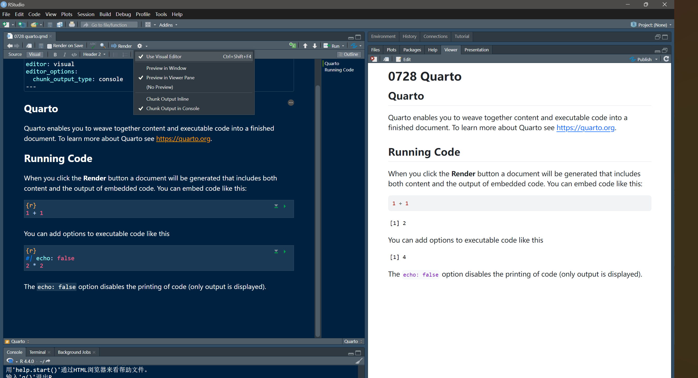
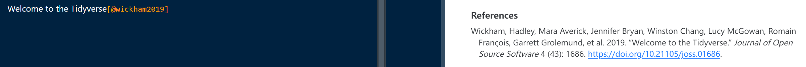

# 前言

到目前为止基本上就学完了R的主体部分了。


会到这张图，原来可视化还是中间的环节，communicate才是最后的环节。（其实也是我最欠缺的部分。

那么在这本书最后的两章，主要介绍了Quarto及其相关的格式。

> 以前接触过来似乎都推荐的R markdown，没想到这方面也有所进展。似乎现在Posit也就是Rstudio更推荐这个。（我觉得Hadley这本书就是用这个构建的吧）

# 简介

Quarto提供了一个整体的数据科学的写作框架，代码、结果、文字都放在一起，并且可以用pdf，word之类的文件输出。这个东西的主要目的是

1. 和决策者传达信息，因为他们更关注结论而不是代码
2. 和其他同行（包括未来的自己），这些人可能对如何得到结果的代码更感兴趣。
3. 这就是现代实验室的笔记本了，记录了咱们的所思所想所做

> 其实我一直理解就是R语言的jupyter，虽然我后来了解到jupyter的R就是R语言的意思。

Quarto是一个命令行界面工具而不是R包，所以文档是不能通过`?`的方式得到。以后遇到问题可以看一下Quarto的官方文档。

https://quarto.org/

> 看到了吧，其实python也是支持的好像

作者也解释了，Quarto其实把Rmarkdown生态系统(rmarkdown, bookdown, distill, xaringan, etc.)也聚合在了一起。同时还支持Python和Julia

> 那不就是Jupyter的竞争对手嘛。
>
> jupyter是木星jupiter的谐音；quarto似乎是四开的英文
>
> 
>
> 你看下面这么多，果真是quarto变成了首选啊。

# Quarto基础

先来看看一个Quarto文件长啥样。(后缀.qmd)

~~~yaml
---
title: "Diamond sizes"
date: 2022-09-12
format: html
---

```{r}
#| label: setup
#| include: false

library(tidyverse)

smaller <- diamonds |> 
  filter(carat <= 2.5)
```

We have data about `r nrow(diamonds)` diamonds.
Only `r nrow(diamonds) - nrow(smaller)` are larger than 2.5 carats.
The distribution of the remainder is shown below:

```{r}
#| label: plot-smaller-diamonds
#| echo: false

smaller |> 
  ggplot(aes(x = carat)) + 
  geom_freqpoly(binwidth = 0.01)
```
~~~

主要的构成就是三个部分:

- YAML的开头，用三个横线包裹
- 代码块，和md一样，用三个反引号包包裹<code>```</code>
- 文本（和md差不多的，应该叫做富文本）

> [MarkDown代码块如何打出反引号](https://blog.csdn.net/weixin_42721886/article/details/137864017)

看看在Rstudio里面怎么运行出这个qmd文件。（之后再用VS code试一试，我找到了quarto也有对应的插件）


创建好了之后就会有一个模板样子的，看样子是一个类似typora的，可以通过source和visual查看源代码和实时预览的模式，如果要查看渲染的方式，如果不经过修改，默认直接点击render就会输出一个html文件，但是要同一个界面预览，那就要修改一下设置。




与此同时在左边新起一行，看到和notion或者语雀很像的，不需要md语法也可以加入富文本。

并且这个文档是可以单独运行一块块代码的，

我们把之前示例的那个放进去，然后用快捷键`ctrl+shift+K`重新渲染一次（knitr的意思，自动就会运行 `quarto::quarto_render("当前文件名")`的函数）

我们可以看到最后的输出和这本书里的一样（我就懒得自己截图了）

那么这里经过了knitr渲染的过程


> 这里knitr和pandoc都是有说法的。
>
> https://yihui.org/knitr/
>
> [https://pandoc.org](https://pandoc.org/)
>
> pandoc就不用说了，之前捣鼓obsidian的时候就接触过，把md渲染为pdf，至于knitr我记得李东风的R语言课程用到很多这个。
>
> https://www.math.pku.edu.cn/teachers/lidf/docs/Rbook/html/_Rbook/rmarkdown.html
>
> 李东风的教程后面有一些关于rmarkdown的介绍，可以学习一下。

> 默认一开始的例子是会呈现代码的，但是书里的这个例子是不展示的，说明这个代码块头部也有一定的设置作用。估计后面是会讲的。

## 练习

这个就不练习了，Latex我这个电脑没有安装，安装也是得折腾很久，咱们也不常用。

# 可视化编辑器

所谓的可视化编辑器就是所见即所得的编辑器（typora我已经用了很久了，但是这里更像是语雀这种。）

只用一个斜杠就可以开始这一段的书写了，插入任意格式的东西，当然，内容肯定是更不一样的

如果是在用中文写的话也没事，`ctrl+/`也可以。

当然上面还有一个insert按钮，想插入什么，用这个也可以

![A Quarto document displaying various features of the visual editor such as text formatting (italic, bold, underline, small caps, code, superscript, and subscript), first through third level headings, bulleted and numbered lists, links, linked phrases, and images (along with a pop-up window for customizing image size, adding a caption and alt text, etc.), tables with a header row, and the insert anything tool with options to insert an R code chunk, a Python code chunk, a div, a bullet list, a numbered list, or a first level heading (the top few choices in the tool).](./0728 Quarto.assets/quarto-visual-editor.png)

并且一些东西在放进去之后还可以进行弹窗的修改。这个就不多说了。

> 实际上，Quarto 使用 Pandoc Markdown（一种 Quarto 可理解的 Markdown 的扩展版本，包括表格、引用、交叉引用、脚注、divs/spans、定义列表、属性、原始 HTML/TeX 等功能，以及执行代码单元格和查看其输出的内联支持。

## 练习

> Using the visual editor, insert a code chunk using the Insert menu and then the insert anything tool.


通过加入这么一个代码块，原来默认的是同时展示代码和结果

> Using the visual editor, figure out how to:
>
> 1. Add a footnote.
> 2. Add a horizontal rule.
> 3. Add a block quote.


> In the visual editor, go to Insert > Citation and insert a citation to the paper titled [Welcome to the Tidyverse](https://joss.theoj.org/papers/10.21105/joss.01686) using its DOI (digital object identifier), which is [10.21105/joss.01686](https://doi.org/10.21105/joss.01686). Render the document and observe how the reference shows up in the document. What change do you observe in the YAML of your document?


还能插入文献，真神奇，甚至都能用这个写论文了哈哈哈。

YAML开头变成了在，这个应该是引用格式，latex里面我们稍微了解一点。

```yaml
---
title: "Diamond sizes"
date: 2022-09-12
format: html
editor_options: 
  chunk_output_type: console
bibliography: references.bib
---
```



在实际渲染出来也是一个注释一样的。

# 源编辑器

在Rstudio里面也可以用源编辑器

那作者也是写了一些md来展示md语法和渲染结果的关系

```R
## Text formatting

*italic* **bold** ~~strikeout~~ `code`

superscript^2^ subscript~2~

[underline]{.underline} [small caps]{.smallcaps}

## Headings

# 1st Level Header

## 2nd Level Header

### 3rd Level Header

## Lists

-   Bulleted list item 1

-   Item 2

    -   Item 2a

    -   Item 2b

1.  Numbered list item 1

2.  Item 2.
    The numbers are incremented automatically in the output.

## Links and images

<http://example.com>

[linked phrase](http://example.com)

{fig-alt="Quarto logo and the word quarto spelled in small case letters"}

## Tables

| First Header | Second Header |
|--------------|---------------|
| Content Cell | Content Cell  |
| Content Cell | Content Cell  |
```

结果就不展示了，反正md语法我也是会的。实在忘记了，Rstudio还很贴心的把markdown参考放在了help里面


不愧是商业软件啊。（还在这里发现了别的一些有意思的东西）

## 练习

这里也不多说了，写多了比较麻烦

值得注意的是，在Word里面设置的标题，删除线，加粗等格式，也可以直接复制进来。源码里面也会帮我们写好。相当于是在一定程度上保留格式了。但是比如你要红色的字，md是做不到的（其实写进一些html css也可以，但是这样复制是不会这么操作的）

# 代码块

我们知道，在quarto里面是可以运行代码的，但是你得让他知道是代码，用法和md一样的。三个反引号包裹，大括号内标记语言类型。快捷键`ctrl+alt+I`

> 按钮也有两个

运行的方式，`ctrl+enter`逐行运行，`ctrl+shift+enter`运行代码块内所有代码

这个代码块的参数都在开头的井号竖杠方式设置，`#|`

## 标签

~~~R
```{r}
#| label: simple-addition

1 + 1
```
~~~

通过设置代码块的标签，在左下角就能快速导航了。


这个代码块生成的图片也会有名字。

还能设置缓存块网络（估计是下次打开结果还是保留的）

名字可以随便你自己起，建议一个短横线分隔单词 `-`

`setup`标签是独特的，任何代码开启前都会再自动运行一次这里的代码

除此以外，标签是唯一不能重复滴

## 选项

[https://yihui.org/knitr/options](https://yihui.org/knitr/options/)

这些代码块几乎有60个可以设置的选项，学一些最常用的就好了，遇到了超纲的需求再去查文档就好了。

- `eval: false`相当于是禁用这一块代码， 自然也不会显示结果，也可以起到注释的作用。主要的作用还是只展示代码。
- `include: false` 运算，但是代码和结果都不展示，相当于后台运行。幕后工人。
- `echo: false` 只展示结果，不展示代码。相当于防止别人偷看代码了。
- `message: false`  `warning: false` 可以试试下面这个例子，相当于是不展示警告和消息的输出

```R
a <- 1:5
for(i in a){
  if(i%%3==0){
    message('3 yes')
  }else{
    warning("not 3")
  }
}
```

- `results: hide` 隐藏结果 `fig-show: hide` 隐藏图形（警告和消息都不会隐藏滴）
- `error: true`如果遇到报错代码是不能渲染出来的，除非这么设置

```R
{r}
#| label: simple-addition
#| error: true
a <- "1"
a+2
print(a)
```

就会保留报错，并且继续运行后面的代码了。

hadley还贴心的用表格的形式展示了代码的效果


## 全局选项

在开头的YAML进行设置

```R
title: "My report"
execute:
  echo: false
```

所有代码都被隐藏了。

在写书的时候，似乎用了这样的设置

```R
title: "Tutorial"
knitr:
  opts_chunk:
    comment: "#>"  #结果前面加个#>
    collapse: true #结果和代码块放一起
```

## 行内代码

前面都是代码块，在行内要放进代码，那就是一个反引号包裹， 这个和md没什么区别的。

但是要行内放入变量，也是这个方式。只不过要r和空格打头

> 这里还是源视图更方便，我没搞懂实时预览界面有什么方便的方法没有。

> We have data about ``r nrow(diamonds)`` diamonds. Only ``r nrow(diamonds) - nrow(smaller)`` are larger than 2.5 carats. The distribution of the remainder is shown below:

实际展示是

> We have data about 53940 diamonds. Only 126 are larger than 2.5 carats. The distribution of the remainder is shown below:

但是有的时候数据结果是双精度的小数，这个时候就推荐自己写一个函数进行一个转换。用的是`format()`函数。

```R
comma <- function(x) format(x, digits = 2, big.mark = ",")
comma(3452345)
#> [1] "3,452,345"
comma(.12358124331)
#> [1] "0.12"
```

但是再大就是科学计数法了，估计还得别的调整。

## 练习

第一个比较简单就不需要了。

第二个是knitr展示表格吗？

```R
mytable<- diamonds %>% 
  arrange(desc(carat)) %>% 
  head(20)
knitr::kable(mytable)
```

用这个kable函数就可以了。（但是不是后面的内容吗？）

第三个好像没有好说的。

# 图片

在Quarto当中，图片指的既可以是外面嵌入的， 也可以是由代码块生成的。

复制粘贴、insert插入都可以。

## 图片大小

quarto可视化编辑器的一个特性就是可以直接调整图片的大小。双击还能弹窗调整居中啥的。

但是这个部分主要介绍的还是代码块输出图片大小应该怎么调整。看了一下quarto这个章节原始的代码，原来下面这些图片都是在代码块上方注释中设置的。主要的参数有五个：

- `fig-width`,
- `fig-height`
- `fig-asp` 
- `out-width` 
- `out-height`

拔下来就知道这些图片是怎么生成的了。

先来看看一些推荐参数建议

1. 推荐默认参数`fig-width: 6`（6英寸） `fig-asp: 0.618`黄金比例，然后再在单独的代码块中修改`fig-asp`
2. 用百分比的形式控制输出大小，比如70%大小然后居中。（有点像css了）
   out-width: "70%" fig-align: center
3. 呼吸感，不要太拥挤
4. layout-ncol让一行有多个图片，设置为2，那么就相当于每个都是50%的大小

我们来看一下下面这几个图片，都是50%的占比，但是图片宽度不一样，效果原来是不一样的。

~~~YAML
```{r}
#| include: false

plot <- ggplot(mpg, aes(x = displ, y = hwy)) + geom_point()
```

```{r}
#| echo: false
#| fig-width: 4
#| out-width: "50%"
#| fig-alt: |
#|   Scatterplot of highway mileage vs. displacement of cars, where the points 
#|   are normally sized and the axis text and labels are in similar font size 
#|   to the surrounding text.

plot
```

```{r}
#| echo: false
#| fig-width: 6
#| out-width: "50%"
#| fig-alt: |
#|   Scatterplot of highway mileage vs. displacement of cars, where the points 
#|   are smaller than in the previous plot and the axis text and labels are 
#|   smallter than the surrounding text.

plot
```

```{r}
#| echo: false
#| fig-width: 8
#| out-width: "50%"
#| fig-alt: |
#|   Scatterplot of highway mileage vs. displacement of cars, where the points 
#|   are even smaller than in the previous plot and the axis text and labels are 
#|   even smallter than the surrounding text.

plot
```
~~~

这个例子就会发现，图片设置越大，缩放就越明显，字就会越小。那么想要保证所有图片字体大小一致，那么图片百分比缩小了，图片宽度也得缩小

但是我的输出和这本书不一样，那是因为人家的yaml开头都是特殊设计过的。

~~~YAML
# Quarto {#sec-quarto}

```{r}
#| echo: false

source("_common.R")
```

## Introduction
....
~~~

而这个R文件则是有一些设置


看来这个quarto还有很多值得学习啊。看到这里就知道，默认的比例是2/3，这样就不会只调整宽度了。

## 其他重要的选项

```R
#| fig-show: hold
plot
print("shayisi")
plot
```

`fig-show: hold`这个设置可以使得图片在所有代码最后进行展示，不管谁先运行的。

这个的副作用是不能一下子搞太多代码，不然前后关系就变得很弱了，迫使你分解成更小的部分，使得代码更容易理解和解读。

`fig-cap`给图片添加标题，会变成“浮动”吗，这个我暂时不太理解。

当用pdf格式的时候，图片输出默认似乎都是矢量图的，一旦元素比较多，那就会比较慢。`fig-format: "png"`这样这个部分的图片就变成了图片格式，就能加快最终pdf的渲染速度了。

因为代码块命名有大纲索引的特点，所以给图片对应的代码块命名也有助于找到这个图片的相关群。

## 练习

图片的交叉引用，其实在source里面的语法就是一个@跟着代码块对应的label名就好了，但是在editor界面是用不了的，因为@内置了，所以要使用会自动加上一个反斜杠\。但是也不知道为什么insert的工具是找不到这些个东西的，不知道是咋回事。感觉这个还是不太搞得懂。比如嵌入的图片怎么交叉引用也不知道。感觉还得是自己查文档了

> 这个作者的图片都是代码块的形式
>
> ```R
> knitr::include_graphics("quarto/quarto-visual-editor.png")
> ```
>
> 类似这样，似乎这样又能交叉使用了。看来是在quarto和rmd当中使用knitr这一部分内容我了解的还是太少了、

# 表格

讲结果中的表格不再是结果，而是真的表格，那就使用`knitr::kable()`这个函数吧。这个咱们借鉴了李东风的教程也知道了这个用法。

这个表格还有更多自定义的方法，这个得自己去学习了。

还有别的一些生成表格的包

> **gt**, **huxtable**, **reactable**, **kableExtra**, **xtable**, **stargazer**, **pander**, **tables**, and **ascii**

kable的原理其实就是生成对应的md源码。在console里面输出就是这样的。但是gt或许不一样

看来交叉引用的源码前后都要加一个空格，并且引用的是label的内容，而不是cap的内容。

# 缓存

要是想保存结果的方式打开，可以这么设置YAML头头

```YAML
---
title: "My Document"
execute: 
  cache: true
---
```

或者局部缓存

~~~YAML
```{r}
#| cache: true

# code for lengthy computation...
```
~~~

然后knitr会检测代码有没有变化，变了的话就会重新运行，不变那就用缓存的。所以就要谨慎，比如下面这个例子

~~~yaml
```{r}
#| label: raw-data
#| cache: true

rawdata <- readr::read_csv("a_very_large_file.csv")
```
~~~

~~~yaml
```{r}
#| label: processed_data
#| cache: true

processed_data <- rawdata |> 
  filter(!is.na(import_var)) |> 
  mutate(new_variable = complicated_transformation(x, y, z))
```
~~~

第一个代码块如果改动了，比如换了一个文件，第二个代码块也是不会动的。

那这样其实也是有解决方式，那就揪出这个变化的东西，写成字符串的形式。

~~~YAML
```{r}
#| label: processed-data
#| cache: true
#| dependson: "raw-data"

processed_data <- rawdata |> 
  filter(!is.na(import_var)) |> 
  mutate(new_variable = complicated_transformation(x, y, z))
```
~~~

rawdata是存在变量之间的依赖关系的。这个时候knitr就会检测依赖项的变化。更新结果。

但是这样还是不会检测这个文件本身的变化。这个也是有解决方法的

~~~YAML
```{r}
#| label: raw-data
#| cache: true
#| cache.extra: !expr file.mtime("a_very_large_file.csv")

rawdata <- readr::read_csv("a_very_large_file.csv")
```
~~~

那作者就提供了这个解决办法，cache.extra选项可以用`!expr`写进一些R表达式，然后检测文件的修改时间file.mtime

> 但是还是不理解中间的`!expr`，这个才是真正导入一个R表达式的。
>
> 那这样这个extra的参数就不知道是干嘛的了。

如果想清理一次缓存，那也可以这样

```R
knitr::clean_cache()
```

让整个文件全部重新运行一次吧。

别嫌弃人家懒，懒也是一种方便。

## 练习

我能写出一个例子，但是很难展示出来

~~~YAML
```{r}
#| cache: false

a <- 1:10
a
lubridate::now()
```

```{r}
#| cache: true

b <- mean(a)
c <- sd(a)
b;c
lubridate::now()
```

```{r}
#| cache: false

d <- b-c
d
lubridate::now()
```
~~~

可以从这个基础上进行修改，自己试试。

全是false，那结果就是实时更新的。

全是true，那么即使修改了a的输入，后面b和c也是不会改的

再后面加入a的依赖等，反而又会变了。总之还是复现一遍吧。

# 解决问题

这章的标题是troubleshooting，直译就是故障排除。因为这是个文档，说是debug好像也不太合适。但是有的时候quarto也没有达到咱们的要求，那就是需求和结果不匹配，这就是需要排除的故障。比如我上面的交叉引用就是一个。

这是个更麻烦的过程，不像代码可以交互式运行，这里就得渲染了。

一个快捷键`ctrl+alt+R`可以逐行运行代码，找到报错的代码然后停下。但是这个方法针对的是报错的代码。

还有一个需要注意的地方就是quarto和交互环境的工作路径是不一样的，这个需要`getwd()`注意一下。（因为相当于两套班子了）

另外一个就是自己写一些error，print，str来找bug吧

# YAML头部信息

在上面的介绍当中，我们知道了YAML头部可以全局定义一些东西（有点像LaTeX啊）

## 自包含文件

这里指的是生成一个嵌入的html的意思。

一般的html有个html然后还附带一个file文件夹，包含图片，css，js啥的。

但是要想生成一个html给别人，不涉及依赖，那就在YAML里面写上

```R
format:
  html:
    embed-resources: true
```

https://quartopub.com/一个quarto托管平台？也是支持自包含文件

## 参数

这里的参数怎么说呢，有点像一个通用测试实例开头唯一的输入。

比如作者给出的这个例子

~~~R
---
format: html
params:
  my_class: "suv"
---

```{r}
#| label: setup
#| include: false

library(tidyverse)

class <- mpg |> filter(class == params$my_class)
```

# Fuel economy for `r params$my_class`s

```{r}
#| message: false

ggplot(class, aes(x = displ, y = hwy)) + 
  geom_point() + 
  geom_smooth(se = FALSE)
```
~~~

那么这个YAML的参数名和项就变成了一个全局的变量了竟然，但是是在params这个列表中的一个元素

一个好的策略就是在参数里面加入当前时间

```R
params:
  start: !expr lubridate::ymd("2015-01-01")
  snapshot: !expr lubridate::ymd_hms("2015-01-01 12:30:00")
```

怎么越来越有测试这个领域的味道了。

## 参考文献和引用

Quarto也能产生参考文献和引用（LaTeX比md优势的地方），并且支持多种方式：

- [DOI](https://quarto.org/docs/visual-editor/technical.html#citations-from-dois) 
- [Zotero](https://quarto.org/docs/visual-editor/technical.html#citations-from-zotero) 
- Searches of [Crossref](https://www.crossref.org/), [DataCite](https://datacite.org/), or [PubMed](https://pubmed.ncbi.nlm.nih.gov/).
- Your document bibliography (a `.bib` file in the directory of your document)

> 最后这个似乎得懂点LaTX，我好像确实有点印象。但是其实Endnote啥的肯定都能产生。

pandoc的引用方式是 `[@citation]` 这个咱们一开始就用了。

然后更改文献的样式

```R
bibliography: rmarkdown.bib
csl: apa.csl
```

这都指向了一些样式的文献，这里提供了一些样式。

https://github.com/citation-style-language/styles

# 工作流

基本的工作流，似乎是控制台和编辑器交替使用的。而quarto则是融合在了一起了，然后用快捷键运行一块块代码。

和jupyter一样，都指向了一种新型的notebook，应对数据科学的使用场景

1. 一个文档写代码也写文本，方便实验设计、数据处理和结果解释
2. 代码能执行，能可视化，帮助验证假设和分析数据
3. 也提供了笔记本的结构，记录实验步骤，记录观察结果，记录思考过程，便于回顾和分享。
4. 代码文本结合，分析更加透明可重复，利于科学研究、数据决策、思路共享。
5. 支持多种格式输出，应对不同场景，HTML,PDF,Markdown。

https://colinpurrington.com/tips/lab-notebooks 一些关于实验记录本的建议。

Hadley本人也提供了一些建议

1. 描述性的标题，令人遐想的文件名，简短的第一段，描述分析目标。
2. YAML日期记录开始笔记本的日期，建议ISO8601 YYYY-MM-DD的格式。
3. 大费周章走入死胡同，也不必删除，写一个简短的笔记说明为啥失败，然后归档就完事了。
4. 数据录入就不要用R了，非要R，也最好是tribble这样格式清楚的输入（我们知道这些大部分情况下是用来写例子的）
5. 发现了数据文件的错误，也别修改原始数据（虽然现在这样很方便）写代码来修正。（这个我不是很理解）解释为什么这么修改（估计修改过程可溯源）
6. 结束工作之前，需要渲染；用了缓存，清除缓存。（不然下次打开就忘记了为啥能运行了）
7. 包是会更新的，以前能运行的代码，现在估计就不行了。为了让代码在未来也能运行，最好追踪一下当时代码能运行的时候的环境，R包版本。严谨的方法是renvhttps://rstudio.github.io/renv/index.html。`sessionInfo()`虽然不能直接复现包，但是至少知道当时的一些环境信息（交流的时候经常使用）
8. 良好的存储习惯，以便将来能找到。

# 总结

总感觉这个章节还有好多话没有说，甚至说不出，只能是靠自己悟。自学去吧

[https://quarto.org](https://quarto.org/) quarto官网学使用

[https://happygitwithr.com](https://happygitwithr.com/) R语言的git与他人协作吧

英文写作也有书籍推荐啊

[*Style: Lessons in Clarity and Grace*](https://www.amazon.com/Style-Lessons-Clarity-Grace-12th/dp/0134080416)

[*The Sense of Structure: Writing from the Reader’s Perspective*](https://www.amazon.com/Sense-Structure-Writing-Readers-Perspective/dp/0205296327)

https://www.georgegopen.com/litigation-articles.html

不愧是hadley，还是太全面了。

这章就这么结束了，虽然我觉得在很久的将来我都不会用到quarto，毕竟不像jupyter还是面向编程，我感觉这个更偏向编程。（毕竟jupyter似乎不能转换为md）

那怎么还有一章呢？你就不好奇这本书是怎么用quarto构建多个章节吗？除了html之外还能怎么输出呢？请看下一节，quarto格式。